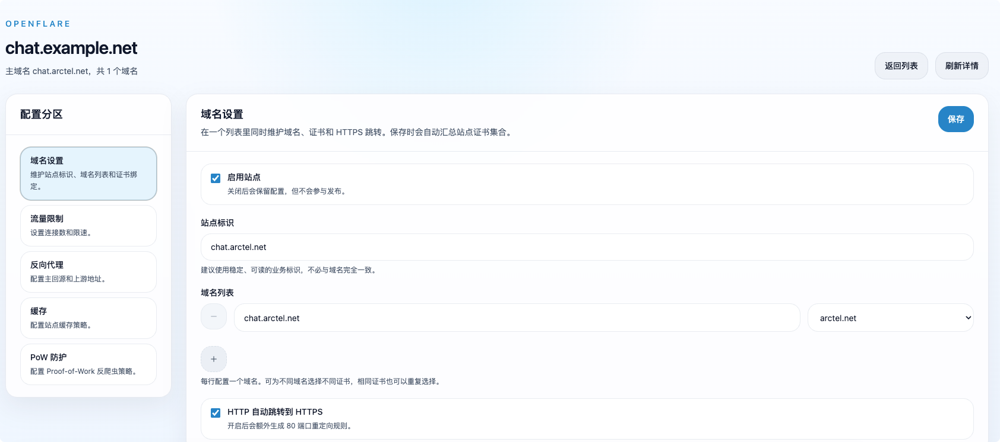

<div align="center">

# OpenFlare

**[English](./README.en.md) | [📖 中文](./README.md)**

OpenFlare is an open-source CDN orchestration and edge security platform. It supports reverse proxies, centralized configuration synchronization, secure intranet penetration (Tunnels), dynamic WAF protection, and anti-CC challenges.

</div>

<p align="center">
  <a href="https://raw.githubusercontent.com/Rain-kl/OpenFlare/main/LICENSE">
    
  </a>
  <a href="https://github.com/Rain-kl/OpenFlare/releases/latest">
    
  </a>
  <a href="https://github.com/Rain-kl/OpenFlare/pkgs/container/openflare">
    
  </a>
</p>

> [!WARNING]
> After logging in for the first time with the `root` user, make sure to change the default password `123456`.
> 
> The BETA version is a temporary product for the development and testing phase. It may contain unknown issues and should not be used in production environments.

## Documentation

**https://open-flare.pages.dev**

Quick links:

* [Quick Start](https://open-flare.pages.dev/en/guide/quick-start)
* [Deployment Guide](https://open-flare.pages.dev/en/deployment/deployment)
* [Configuration Reference](https://open-flare.pages.dev/reference/configuration)
* [System Design](https://open-flare.pages.dev/design/)

## Core Features

* **Reverse Proxy Management**: Website rules as the aggregation boundary, supporting multi-domain binding and multi-upstream load balancing with unified management of all OpenResty node configurations.
* **Immutable Config Version Control**: Full-snapshot publish model based on version numbers (`YYYYMMDD-NNN`), with pre-publish diff preview, a single globally active version, and one-click sub-second rollback.
* **Secure Intranet Penetration (Tunnels)**: An open-source alternative to Cloudflare Tunnels. Securely expose local intranet Web services to the public network via Relay and OpenFlared clients — no public IP or open inbound ports required.
* **Edge WAF Safety Protection**: Provides global and custom rule groups, supporting manual/automatic/subscription IP groups, MaxMind GeoIP country-level access control, Checksum-based differential IP group sync (no Nginx reload), and custom block responses.
* **Anti-CC & Human-Machine Challenge (PoW)**: Built-in high-performance client-side cryptographic Proof of Work challenges (similar to Turnstile) to block and intercept botnets and scrapers at the gateway edge in seconds.
* **Pages Static Hosting**: Upload pre-built ZIP packages directly; edge Agents pull and serve them via local OpenResty, with SPA Fallback and built-in API reverse proxy configuration.
* **Automated TLS Certificate Management**: Supports dynamic certificate upload, automatic multi-domain certificate matching and binding, and ACME-based automatic issuance and renewal via Let's Encrypt.
* **Uptime Kuma Monitoring Sync**: Integrates with Uptime Kuma to automatically sync the monitoring site list using differential updates, providing real-time awareness of node availability and service health.
* **SSO Single Sign-On**: Supports GitHub OAuth and standard OIDC protocol for seamless integration with enterprise identity providers.
* **Unified Observability**: Aggregates node request metrics, real-time access log details, host/Nginx resource snapshots, health events, and a re-upload buffer for network fluctuations.

## Quick Start

### 1. Launch Server

```yaml
services:
  openflare:
    image: ghcr.io/rain-kl/openflare-server:latest
    restart: unless-stopped
    env_file: .env
    environment:
      TZ: ${TZ:-Asia/Shanghai}
    ports:
      - "3000:3000"
    volumes:
      - ./uploads:/app/uploads
    depends_on:
      postgres:
        condition: service_healthy
      redis:
        condition: service_healthy
      clickhouse:
        condition: service_healthy

  postgres:
    image: postgres:17-alpine
    restart: unless-stopped
    environment:
      POSTGRES_DB: openflare
      POSTGRES_USER: openflare
      POSTGRES_PASSWORD: replace-with-strong-password
    volumes:
      - ./data/postgres_data:/var/lib/postgresql/data
    healthcheck:
      test: ["CMD-SHELL", "pg_isready -U openflare -d openflare"]
      interval: 10s
      timeout: 5s
      retries: 5

  redis:
    image: valkey/valkey:8.0-alpine
    restart: unless-stopped
    command: ["valkey-server", "--appendonly", "yes"]
    volumes:
      - ./data/valkey:/data
    healthcheck:
      test: ["CMD", "valkey-cli", "ping"]
      interval: 10s
      timeout: 5s
      retries: 5
      start_period: 5s

  clickhouse:
    image: clickhouse/clickhouse-server:25.3-alpine
    restart: unless-stopped
    environment:
      CLICKHOUSE_DB: openflare
      CLICKHOUSE_USER: default
      CLICKHOUSE_PASSWORD: 123456
      CLICKHOUSE_DEFAULT_ACCESS_MANAGEMENT: 1
      TZ: ${TZ:-Asia/Shanghai}
    volumes:
      - ./data/clickhouse_data:/var/lib/clickhouse
    healthcheck:
      test: ["CMD", "clickhouse-client", "--query", "SELECT 1"]
      interval: 10s
      timeout: 5s
      retries: 5
      start_period: 15s
```

```bash
docker compose up -d
```

Access at: `http://localhost:3000`

Default credentials:

* Username: `root`
* Password: `123456`

### 2. Install Agent

Before installing an Agent, please install OpenResty on the target node first, or use the Agent Docker image with OpenResty built-in.

You can copy the installation command from **Node Management -> Details -> Node Info -> Node Token & Deployment** in the control panel, or directly use the scripts below:

#### Docker Deployment

For Docker deployment, you can directly run the Agent image:

```bash
docker pull ghcr.io/rain-kl/openflare-agent:latest
docker rm -f openflare-agent 2>/dev/null || true
docker run -d --name openflare-agent --restart unless-stopped \
  -p 80:80 -p 443:443/tcp -p 443:443/udp \
  -e OPENFLARE_SERVER_URL=http://your-server:3000 \
  -e OPENFLARE_AGENT_TOKEN=YOUR_AGENT_TOKEN \
  ghcr.io/rain-kl/openflare-agent:latest
```

#### Local Installation

Using `discovery_token` to register:

```bash
curl -fsSL https://raw.githubusercontent.com/Rain-kl/OpenFlare/main/scripts/install-agent.sh | bash -s -- \
  --server-url http://your-server:3000 \
  --discovery-token YOUR_DISCOVERY_TOKEN
```

Using node-specific `agent_token`:

```bash
curl -fsSL https://raw.githubusercontent.com/Rain-kl/OpenFlare/main/scripts/install-agent.sh | bash -s -- \
  --server-url http://your-server:3000 \
  --agent-token YOUR_AGENT_TOKEN
```

The installation script defaults to `/opt/openflare-agent`, creates a `openflare-agent.service`, automatically searches for `openresty`, and can be executed repeatedly to reinstall or upgrade the Agent.

### 3. Uninstall Agent

To completely uninstall the Agent and clear local data, run:

```bash
curl -fsSL https://raw.githubusercontent.com/Rain-kl/OpenFlare/main/scripts/uninstall-agent.sh | bash
```

The uninstallation script will stop and remove the `openflare-agent.service`, and delete the entire `/opt/openflare-agent` directory. It will not delete the local OpenResty installation.

### 4. Publish Your First Configuration

1. Log in to the management panel and add a reverse proxy rule.
2. View the preview or change summary before publishing.
3. Activate the new version.
4. Agents will receive the configuration and apply it via WebSocket notification or subsequent heartbeats.

The version number format is fixed as `YYYYMMDD-NNN`. Historical versions are immutable, and rollback is achieved by reactivating an older version.

## UI Preview

### Dashboard Overview


### Node Details


### Proxy Configuration



## Management Panel & API

The management panel includes:

* Reverse Proxy Rules
* Configuration Versions
* Node Management
* Application Records
* TLS Certificates
* Domain Management
* Pages Static Hosting
* WAF Rule Groups
* Intranet Tunnels
* Uptime Kuma Monitoring Sync
* SSO Login Configuration
* User Management
* Settings
* Version Updates
* PoW Rules

After logging in to the dashboard, access Swagger UI at: `/swagger/index.html`

## License

This project is licensed under [Apache License 2.0](./LICENSE).

## Star History

<a href="https://www.star-history.com/?repos=Rain-kl%2FOpenFlare&type=date&legend=bottom-right">
 <picture>
   <source media="(prefers-color-scheme: dark)" srcset="https://api.star-history.com/chart?repos=Rain-kl/OpenFlare&type=date&theme=dark&legend=top-left" />
   <source media="(prefers-color-scheme: light)" srcset="https://api.star-history.com/chart?repos=Rain-kl/OpenFlare&type=date&legend=top-left" />
   
 </picture>
</a>
