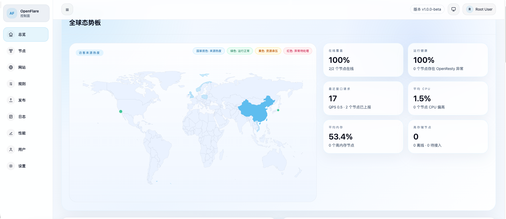
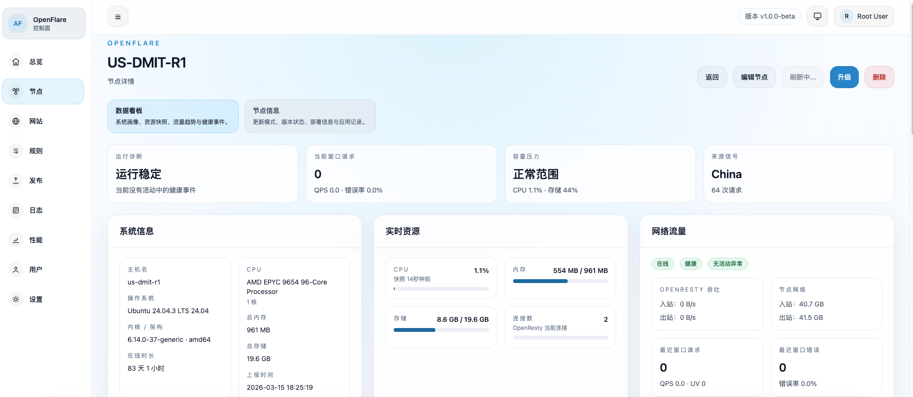

<p align="right">
  <strong>中文</strong> | <a href="./README.en.md">English</a>
</p>

<div align="center">
  

# OpenFlare

轻量、自托管的反向代理控制面，用于管理 Nginx 配置发布、节点同步、TLS 证书与版本回滚。

</div>

<p align="center">
  <a href="https://raw.githubusercontent.com/Rain-kl/OpenFlare/main/LICENSE">
    
  </a>
  <a href="https://github.com/Rain-kl/OpenFlare/releases/latest">
    
  </a>
  <a href="https://github.com/Rain-kl/OpenFlare/pkgs/container/openflare">
    
  </a>
  <a href="https://goreportcard.com/report/github.com/Rain-kl/OpenFlare">
    
  </a>
</p>

## 项目定位

OpenFlare 当前定位为内部自用的反向代理控制面，不面向外部租户提供 CDN SaaS 能力。

它解决的是一套更直接的运维问题：

* 在管理端维护域名到源站的反代规则
* 生成完整 Nginx 配置并发布激活版本
* 让节点侧 Agent 自动拉取、校验、reload 与失败回滚
* 托管 TLS 证书、管理节点与版本状态
* 用更统一的 Web UI 完成日常运维操作

当前明确不做多租户、复杂缓存平台、对象存储依赖、灰度分组发布等平台化扩展。详细边界见 [docs/design.md](./docs/design.md)。

## 核心能力

* 反向代理规则管理：一个域名对应一个源站地址，统一维护、统一发布
* 配置版本化：支持预览、发布、激活、历史回滚，版本不可变
* 节点接入：支持全局 `discovery_token` 首次接入，也支持节点专属 `agent_token`
* Agent 自动应用：周期性同步、落盘、`openresty -t`、`openresty -s reload`、失败自动回滚
* 节点观测：Agent 会向受管 OpenResty 注入 Lua 观测脚本，按 heartbeat 上报最近窗口请求、错误、UV 与连接指标
* TLS 与域名管理：支持证书托管、域名资产维护、精确匹配与通配符匹配
* 运维能力：配置变更摘要、Agent 运行参数下发、Agent 正式版自动更新与 preview 手动升级、Server 正式版 GitHub 自升级、Server preview 手动检查升级、Server 手动上传二进制确认升级
* 管理端 UI：基于 Next.js App Router + React 19 + Tailwind CSS 4 的新版前端

## 界面预览

以下图片当前为占位文件，后续你可以直接替换同名文件：

* `docs/assets/readme/dashboard-overview.svg`
* `docs/assets/readme/node-detail.svg`
* `docs/assets/readme/version-release.svg`

### 仪表盘总览



### 节点详情与安装命令



### 配置发布与版本管理


## 系统架构

```text
OpenFlare Server (Gin + GORM + SQLite + Web UI)
        |
        | HTTP API / Config Pull
        v
OpenFlare Agent (register / heartbeat / sync / apply / update)
        |
        v
Local Nginx or Docker Nginx
        |
        v
Origin
```

职责划分：

* `openflare_server`：管理端 UI、管理 API、Agent API、配置渲染、发布与激活、状态存储
* `openflare_agent`：节点注册、心跳、同步、本地文件写入、Nginx 校验、reload、回滚、自更新
* `openflare_server/web`：新版管理端前端，静态导出后由 Go Server 托管

## 仓库结构

* `openflare_server`：Gin + GORM + SQLite 单体控制面
* `openflare_server/web`：Next.js 15 App Router 管理端前端
* `openflare_agent`：Go 单体 Agent
* `scripts`：安装脚本与辅助脚本
* `docs`：设计、开发规范、部署、配置项等文档

## 快速开始

### 1. 通过 Docker Compose 启动 Server

```yaml
services:
  openflare:
    image: ghcr.io/rain-kl/openflare:latest
    restart: unless-stopped
    ports:
      - "3000:3000"
    environment:
      SESSION_SECRET: replace-with-random-string
      SQLITE_PATH: /data/openflare.db
      GIN_MODE: release
      LOG_LEVEL: info
      PORT: "3000"
    volumes:
      - openflare-data:/data

volumes:
  openflare-data:
```

```bash
docker compose up -d
```

访问地址：`http://localhost:3000`

默认账号：

* 用户名：`root`
* 密码：`123456`

### 2. 使用 Discovery Token 一键接入 Agent

适用于新节点首次接入，Agent 会自动注册并换取节点专属 `agent_token`。

```bash
curl -fsSL https://raw.githubusercontent.com/Rain-kl/OpenFlare/main/scripts/install-agent.sh | bash -s -- \
  --server-url http://your-server:3000 \
  --discovery-token YOUR_DISCOVERY_TOKEN
```

### 3. 使用 Agent Token 一键接入 Agent

适用于已经在管理端预创建节点、并拿到节点专属 `agent_token` 的场景。

```bash
curl -fsSL https://raw.githubusercontent.com/Rain-kl/OpenFlare/main/scripts/install-agent.sh | bash -s -- \
  --server-url http://your-server:3000 \
  --agent-token YOUR_AGENT_TOKEN
```

说明：

* `--server-url` 替换为实际控制面地址，例如 `http://192.168.1.10:3000`
* 默认安装目录为 `/opt/openflare-agent`
* 脚本会创建 `openflare-agent.service` 并启动 systemd 服务
* 重复执行安装命令可用于重装或升级 Agent 到最新 Release
* 重装时会先删除整个安装目录，再重新生成 `agent.json`、本地状态和二进制；旧数据不会保留

## 典型使用流程

1. 启动 Server 并登录管理端
2. 新增或编辑反代规则
3. 预览配置或查看变更摘要
4. 发布并激活新的配置版本
5. Agent 在后续同步中拉取激活版本
6. Agent 本地执行 `nginx -t`
7. 校验成功后执行 `nginx -s reload`
8. 若失败则自动回滚并上报最终结果

版本号格式固定为 `YYYYMMDD-NNN`，历史版本不可变，回滚通过重新激活旧版本实现。

## 部署与交付

当前仓库的交付形式：

* Server 二进制发布到 GitHub Releases
* Server Docker 镜像发布到 GitHub Container Registry：`ghcr.io/rain-kl/openflare`
* Agent 二进制发布到 GitHub Releases

Docker 镜像工作流仅构建 `openflare_server`，并产出 `linux/amd64` 与 `linux/arm64` 多架构镜像。

## 常用配置

### Server 环境变量

| 环境变量 | 作用 | 默认值 |
| --- | --- | --- |
| `PORT` | Server 监听端口 | `3000` |
| `GIN_MODE` | Gin 运行模式 | 非 `debug` 时按 release |
| `SESSION_SECRET` | Session 签名密钥 | 启动时随机生成 |
| `SQLITE_PATH` | SQLite 数据库文件路径 | `openflare.db` |
| `SQL_DSN` | MySQL DSN，设置后优先于 SQLite | 空 |
| `UPLOAD_PATH` | 上传目录 | `upload` |

### 前端构建变量

| 环境变量 | 作用 | 默认值 |
| --- | --- | --- |
| `NEXT_PUBLIC_API_BASE_URL` | 前端请求 API 的基础路径 | `/api` |
| `NEXT_PUBLIC_APP_VERSION` | 前端展示版本号 | `dev` |

### Agent 核心配置

| 字段 | 作用 |
| --- | --- |
| `server_url` | 控制面地址 |
| `agent_token` | 节点专属认证 Token |
| `discovery_token` | 首次自动注册使用的全局 Token |
| `data_dir` | Agent 托管数据目录 |
| `cert_dir` | Agent 存放受管证书文件的目录 |
| `lua_dir` | Agent 存放受管 Lua 观测脚本的目录；启动时自动覆盖释放 |
| `openresty_observability_port` | Agent 读取 OpenResty Lua 本地观测指标的 loopback 端口 |
| `observability_buffer_path` | Agent 本地观测补报缓冲文件路径 |
| `observability_replay_minutes` | Agent 恢复 heartbeat 后允许自动补传的最近观测窗口分钟数 |
| `nginx_path` | 本机 Nginx 路径，设置后走本机模式 |
| `nginx_container_name` | Docker 模式下的 Nginx 容器名 |

完整配置项说明见 [docs/app-config.md](./docs/app-config.md)。

## 本地开发

### Server

```bash
cd openflare_server
export SESSION_SECRET='replace-with-random-string'
export SQLITE_PATH='./openflare.db'
go run .
```

### Frontend

```bash
cd openflare_server/web
corepack enable
pnpm install
pnpm build
```

### Agent

```bash
cd openflare_agent
go run ./cmd/agent -config /path/to/agent.json
```

### 常用验证命令

```bash
cd openflare_server
GOCACHE=/tmp/openflare-go-cache go test ./...
```

```bash
cd openflare_agent
GOCACHE=/tmp/openflare-go-cache go test ./...
```

## 文档导航

建议按以下顺序阅读：

1. [docs/design.md](./docs/design.md)
2. [docs/development-guidelines.md](./docs/development-guidelines.md)
3. [docs/development-plan.md](./docs/development-plan.md)
4. [docs/frontend-revamp-plan.md](./docs/frontend-revamp-plan.md)
5. [docs/frontend-development-guidelines.md](./docs/frontend-development-guidelines.md)
6. [docs/deployment.md](./docs/deployment.md)
7. [docs/app-config.md](./docs/app-config.md)

## 管理端与接口

管理端当前覆盖：

* 反代规则
* 配置版本
* 节点管理
* 应用记录
* TLS 证书
* 域名管理
* 用户管理
* 设置
* 版本更新

登录管理端后，可访问 Swagger UI：`/swagger/index.html`

## 贡献开发

参与开发前请先阅读：

* [docs/design.md](./docs/design.md)
* [docs/development-guidelines.md](./docs/development-guidelines.md)
* [docs/frontend-development-guidelines.md](./docs/frontend-development-guidelines.md)

约束摘要：

* 超出设计边界的改动，先更新设计文档再编码
* Server 继续保持单体结构，不为简单需求引入额外基础设施
* 前端统一位于 `openflare_server/web`，请求层统一收敛到 `lib/api/`
* 新代码默认遵循当前正式基线，不回退到旧版 CRA / Semantic UI 结构
