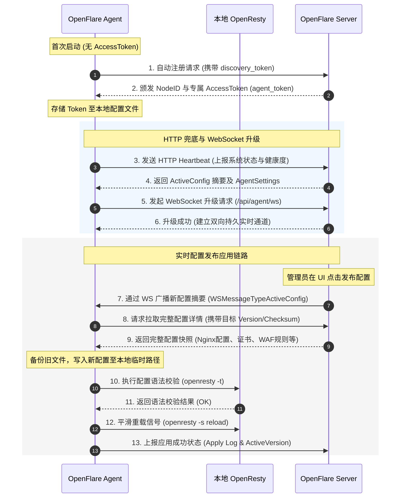
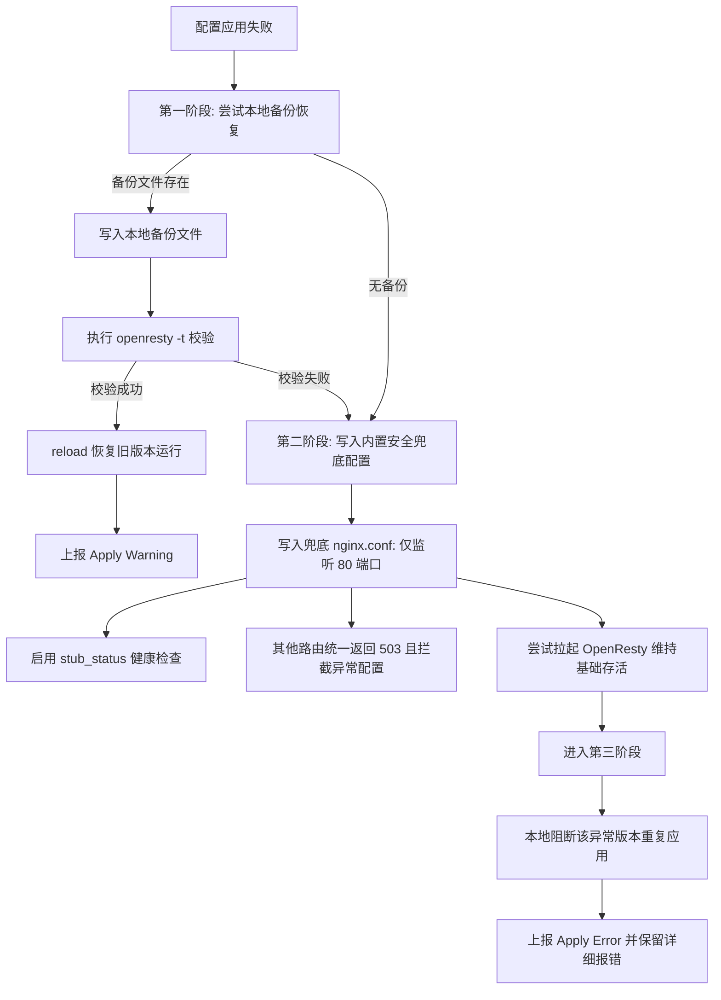

# Agent 设计文档

你会学到：Agent 的设计原则、核心功能模块、与 Server 的交互链路，以及如何通过不可变版本模型与三阶段容灾机制来保证配置应用的安全性和可靠性。

---

## 需求分析

在分布式反向代理与边缘安全网关场景中，Agent 扮演着打通控制面（Server）与数据面（OpenResty）的核心角色。由于 Agent 运行在用户实际的节点服务器上，其设计必须遵循以下核心安全与高可用需求：

1. **主动拉取（Pull 模型）而非被动接收**：Server 不直接持有节点的 SSH 秘钥，也不主动发起向节点的入向连接。所有控制指令与配置更新均由 Agent 主动通过心跳（Heartbeat）或长连接（WebSocket）向上拉取。这消除了节点侧的入向防火墙安全隐患，防止了控制通道被劫持。
2. **极低侵入性**：Agent 作为一个独立的 Go 二进制进程运行，只与本地 OpenResty 进程进行基于文件的配置重写与信号通知交互，不干涉节点上的其他系统服务。
3. **极强容灾与自愈能力**：由于网络抖动、磁盘写满或异常配置等因素极易导致配置同步失败，Agent 必须具备零依赖的本地回滚自愈能力，严防因单次配置失误导致整机服务彻底瘫痪。
4. **纯粹的数据与状态落地**：Agent 仅负责承载 Server 渲染好的文件与控制意图落地，不包含复杂的业务逻辑校验、多端租户鉴权等控制面职责，确保了节点侧的高效与轻量。

---

## 核心功能

Agent 主要由以下核心子模块组成，共同配合完成其完整的生命周期管理：

| 模块名称 | 对应目录 | 功能职责 |
| :--- | :--- | :--- |
| **配置同步** | `sync/` | 负责拉取完整配置包，写入文件，触发重载，记录并回报同步状态。 |
| **心跳管理** | `heartbeat/` | 定期向 Server 上报节点健康状态、资源指标，并获取最新激活版本摘要。 |
| **WebSocket** | `wsclient/` | 保持与 Server 的长连接，提供秒级实时的配置推送与控制面指令响应。 |
| **OpenResty 管控** | `nginx/` | 执行 Nginx 配置校验 (`openresty -t`)、重写、平滑重载 (`reload`) 及进程自启动。 |
| **本地状态库** | `state/` | 持久化记录本地应用版本、错误日志及未成功上报的可观测性指标缓冲。 |
| **自更新服务** | `updater/` | 监听 Server 自更新指令，安全拉取新版本二进制并完成原地热升级。 |
| **可观测性** | `observability/` | 采集系统宿主机 CPU/内存/磁盘及 Nginx 性能指标，处理访问日志并上报。 |
| **GeoIP 维护** | `geoipdata/` `geoipupdate/` | 维护并定期更新本地 GeoIP 数据库，为 WAF 地域过滤提供支撑。 |

---

## 与 Server 的交互链路

Agent 在生命周期中主要通过 **基于 Token 的自动注册** 和 **心跳/WebSocket 双通道** 与控制面通信。

### 1. 自动注册流程
若 Agent 启动时本地 `agent.json` 的 `access_token` 为空，但配置了 `discovery_token`，将触发自动注册流程：
1. Agent 向控制面 `/api/agent/register` 发送注册请求，携带本地硬件摘要、IP 及主机名。
2. Server 校验 `discovery_token` 有效后，在数据库生成唯一的 `NodeID` 与专属 `AccessToken`（即 `agent_token`）并返回。
3. Agent 将获取的专用 Token 写入本地配置文件，擦除一次性 `discovery_token`，后续所有的通信均基于专属 `AccessToken` 进行鉴权认证。

### 2. 双通道心跳与同步机制
* **HTTP 轮询通道（兜底与探测）**：Agent 默认按设定的 `heartbeat_interval` 间隔发送 POST 心跳包。上报指标的同时获取当前激活版本的摘要信息（Version & Checksum）。
* **WebSocket 通道（实时通信）**：在 HTTP 心跳成功后，Agent 自动尝试将连接升级为 WebSocket (`/api/agent/ws`)。
  * WS 连接建立后，心跳与指标上报全面转移到 WS 管道，降低网络开销。
  * Server 发布或激活新版本时，通过 WS 广播通知 Agent。Agent 收到变更事件后，**立即触发同步流程**，实现秒级配置生效。
  * 若 WS 链路因网络问题断开，Agent 自动降级为 HTTP 轮询，并采用指数退避机制尝试重建 WS。

### 3. 交互时序图



---

## OpenResty 的管控

Agent 对数据面 OpenResty 的管控实现了端到端的闭环，包含配置落地、语法验证、平滑重载和异常状态捕获：

### 1. 配置文件的落地组织
同步成功后，Agent 会将配置按照特定的物理结构写入到本地 `/etc/nginx/openflare-lua/` 目录下（或配置指定的 `LuaDir`）：
* `nginx.conf`：主配置文件（替换相关占位符，配置性能参数、Shared Dictionaries 及全局 Server）。
* `routes.conf`：路由配置文件（由 Agent 生成，包含所有代理网站的 Server 块、证书路径、缓存及速率限制指令）。
* `certs/`：证书存放目录（文件命名为 `{cert_id}.crt` 和 `{cert_id}.key`）。
* `waf/` 与 `pow/`：WAF 及防 CC 挑战所需的专用 Lua 运行时脚本。
* `waf_config.json` 与 `waf_ip_groups.json`：WAF 过滤引擎所需的结构化规则配置文件。

### 2. 精细化的重载动作
1. **备份当前配置**：在写入新文件之前，Agent 会将现有的配置文件复制到 `.backup` 临时目录下，保留完整的现场快照。
2. **写入并替换占位符**：将最新拉取的模板写入，自动将模板中的绝对路径占位符（如 `__OPENFLARE_LUA_DIR__`）替换为本地实际运行路径。
3. **语法校验**：调用 `openresty -t -c <temp_nginx.conf>` 进行严格的语法测试。
4. **平滑重载**：若校验通过，将新配置移至正式路径，执行 `openresty -s reload`。若 OpenResty 处于未启动状态，则使用当前配置拉起进程。
5. **捕获异常**：校验或重载失败时，Agent 会截获标准错误输出（stderr），提取前 2000 个字符的详细报错信息。

---

## 发布与配置应用模型

OpenFlare 摒弃了动态 Patch 节点配置的落后方式，采用 **不可变配置版本发布模型**。

```text
修改规则 -> 预览 / 查看 diff -> 发布 -> 生成完整配置版本 -> 激活版本 -> Agent 拉取 -> 本地应用 -> 上报结果
```

### 1. 核心设计原则
* **完整发布**：每次发布均是对当前控制面所有启用路由、证书、全局与局部 WAF 规则进行一次性全量编译，生成带唯一 `checksum` 的完整版本。
* **版本格式**：采用 `YYYYMMDD-NNN` 递增格式，确保版本历史直观、具备单调递增性。
* **全局单激活版本**：系统同时只有一个处于 `active` 状态的全局配置版本。回滚时无需逆向打补丁，只需将历史某个健康版本的状态改为 `active`，Agent 重新拉取应用即可。

### 2. 三阶段容灾回滚机制
当 Agent 发现配置应用（或平滑重载）失败时，将自动激活以下三阶段容灾防瘫痪链路：



1. **第一阶段：本地备份回退**
   * Agent 尝试从前一步保存的 `.backup` 目录恢复主配置、路由及证书。
   * 写入备份文件后，重新执行 `openresty -t` 校验。若成功，重载回退并向 Server 上报 `Warning`（警告：应用新版本失败，已自动退回历史健康版本）。
2. **第二阶段：内置安全兜底运行**
   * 若本地不存在备份配置（如首次部署即配置错误），或者回退备份配置依然校验失败，Agent 将激活最终自愈机制——写入**内置安全兜底配置**。
   * **安全兜底配置规范**：
     * 仅监听 `80` 端口，不包含任何用户的真实反代路由。
     * 除 `/openflare/stub_status` 健康监测路由返回正常外，其他一切访问请求统一返回状态码 `503 Service Unavailable`，响应体固定为 `OpenFlare: No Valid Configuration`。
     * 尝试以此极简配置拉起 OpenResty。这能够确保 Nginx 进程自身不瘫痪，保留了底层的健康检查与探针通道，防止容器/Pod 因健康检查失败而被调度系统不断销毁重启，同时保护了敏感路由的安全性。
3. **第三阶段：本地配置阻断**
   * Agent 会将当前导致崩溃的配置 `version + checksum` 记录在本地状态库的阻断名单中。
   * 在控制面未激活新的配置（`checksum` 发生变化）之前，Agent 心跳将阻断对此异常版本的重复同步拉取，防止节点陷入“心跳 -> 拉取崩溃配置 -> 崩溃回滚”的死循环。

### 3. WAF IP 组运行时异步同步
为了避免高频变动的恶意 IP 黑名单频繁触发主配置的全量发布与 reload（平滑重载对 Nginx 依然有微小的 CPU 与连接开销），IP 组成员采用了与发布版解耦的**异步差分同步设计**：

* **静态发布快照**：发布生成的 `waf_config.json` 中仅包含规则组对 IP 组的引用关系（即 `ip_whitelist_group_ids` / `ip_blacklist_group_ids`），不包含具体的 IP 成员列表。
* **心跳差分对比**：Agent 在心跳包中上报本地已缓存 IP 组的 MD5 Checksum 映射表。
* **差分下发**：Server 比对当前激活版本引用的 IP 组哈希，仅向 Agent 下发缺失或发生变更的 IP 组成员，写入本地 `waf_ip_groups.json`，实现极速差分同步。
* **WebSocket 实时通知**：当 Server 手动更新 IP 组、订阅源自动同步成功、或安全规则自动触发临时封禁时，Server 会立即通过 WebSocket 广播受影响的 IP 组更新包，Agent 接收落地并即时生效，全程**无须 reload Nginx**。

---

## 设计约束

为保证数据与控制链路的安全边界，Agent 代码编写与二次开发必须严格遵守以下工程约束：

1. **零特权指令通道**：Server 绝对禁止向 Agent 传递任何任意 shell 命令或远程执行脚本（如 exec/eval 等）。所有系统控制原语（如启动、停止、重载、更新）必须硬编码在 Agent 二进制内部。
2. **严格的 Token 过滤与前缀验证**：Agent 侧向 Server 请求资源时，接口端点固定以 `/api/agent/` 为前缀，并强制携带 `X-Agent-Token` 进行签名或令牌核验。
3. **节点自治原则**：Agent 须具备完备的离线工作能力。在与 Server 失去连接期间，本地 OpenResty 必须依靠本地已落地的配置保持反向代理服务的绝对正常运行。