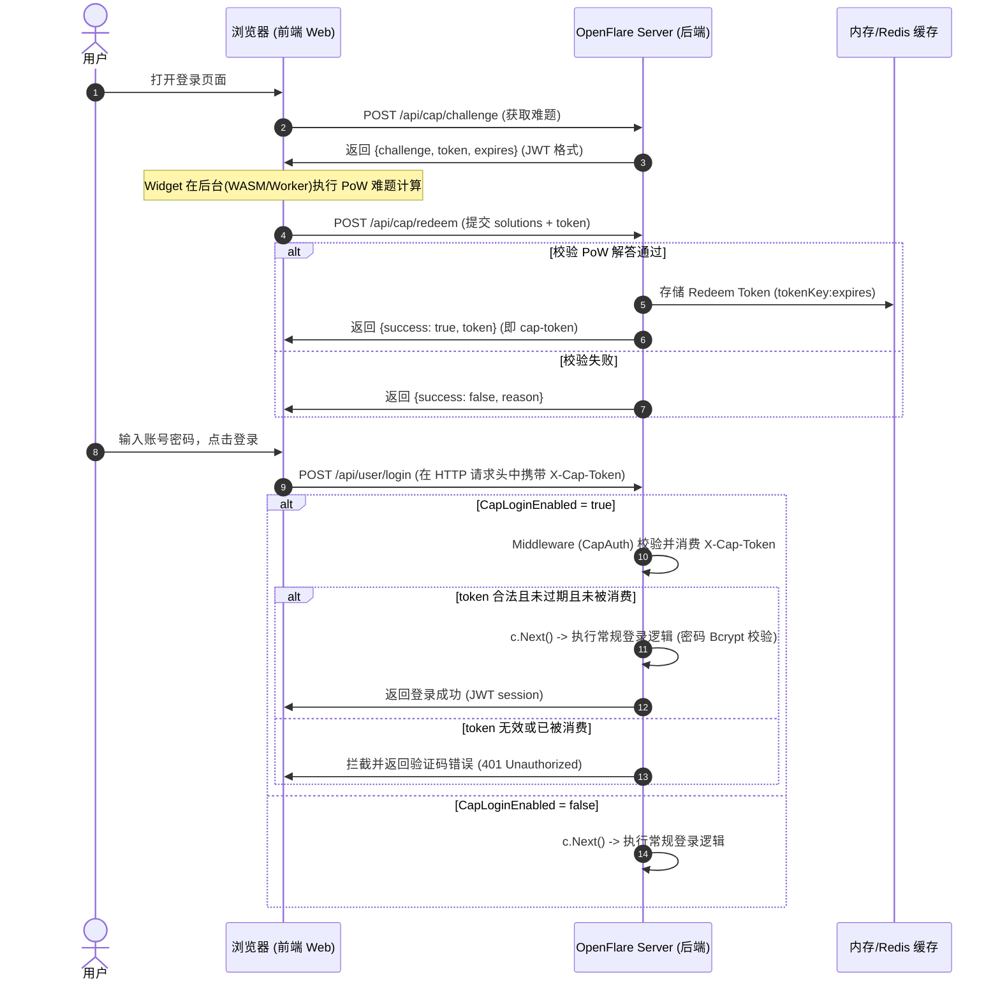

# 登录验证码设计 (Login CAPTCHA Integration)

本文档阐述在 OpenFlare 控制面中引入基于 Proof-of-Work (PoW) 与无感浏览器指纹特征的开源 CAPTCHA 方案 —— Cap，以防止对登录 API 进行暴力破解与爬虫撞库攻击的设计。

---

## 1. 业务背景与产品范围

### 背景与痛点
根据我们的系统安全分析，OpenFlare 的登录端点 `/api/user/login` 虽然配置了基于 IP 的限流限制，但由于缺少用户维度的防护机制，攻击者可使用代理池绕过 IP 限制对高权限账户（如 `root`）实施撞库和暴力破解。同时，对于系统登录页面，标准的视觉验证码对用户体验和无障碍不够友好。

### 产品范围与技术选型
* **技术选型**：Cap (Proof-of-Work 驱动的无感无图像验证码解决方案)。
  - **核心原理**：客户端（Widget/网页）从服务器获取工作量证明 (PoW) 的难题，使用浏览器后台计算求解并将答案回传。服务器验证答案的正确性，完成人机识别。
  - **优势**：无感、无图像验证、不依赖任何外部第三方 API 节点（私密）、包极小。
* **接入范围**：控制面 Server 登录 API（`/api/user/login`）以及前端登录页面。
* **配置粒度**：支持管理员通过控制台 Option 表随时开启/关闭验证码（`CapLoginEnabled`）。

---

## 2. 系统架构与交互时序

### 2.1 模块分工
1. **Frontend (前端)**：
   * 在登录页面引入 `cap-widget`（React 19 自定义元素）。
   * 提交表单时，伴随提交由 Widget 求解出并得到的 `cap-token`。
2. **Server (控制面后端)**：
   * 暴露 `POST /api/cap/challenge` 接口，为客户端分发 PoW 难题和签名的 JWT Token。
   * 暴露 `POST /api/cap/redeem` 接口，校验客户端提交的 PoW 解答并核发带有失效时间的登录凭证（Redeem Token）。
   * 将 Redeem Token 与对应过期时间保存在内存缓存/Redis 缓存中。
   * 在 `POST /api/user/login` 接口中，若启用了验证码保护，先校验并消耗（单次失效）对应的 `cap-token`。

### 2.2 验证流时序图


---

## 3. 核心接口与数据模型

### 3.1 接口定义

#### 1. 获取难题 (GET/POST /api/cap/challenge)
* **请求方式**：`POST`
* **接口权限**：公开
* **响应负载**（统一 API 信封，`data` 为业务载荷）：
  ```json
  {
    "error_msg": "",
    "data": {
      "challenge": {
        "c": 50,
        "s": 32,
        "d": 4
      },
      "token": "eyJhbGciOiJIUzI1NiIsInR5cCI6IkpXVCJ9...",
      "expires": 1717660800000
    }
  }
  ```

#### 2. 核销难题 (POST /api/cap/redeem)
* **请求方式**：`POST`
* **请求负载**：
  ```json
  {
    "token": "challenge_jwt_token_here",
    "solutions": [12345, 67890, 54321]
  }
  ```
* **响应负载 (成功)**：
  ```json
  {
    "success": true,
    "token": "random_id:ver_token",
    "expires": 1717661000000
  }
  ```

#### 3. 登录接口 (POST /api/user/login)
* **请求负载保持不变**：
  ```json
  {
    "username": "root",
    "password": "your_password"
  }
  ```
* **验证码载体**：放置于 HTTP Request Header `X-Cap-Token` 中。

---

## 4. 重放攻击防护与安全性权衡
1. **JWT 临时状态绑定**：难题在生成时就被签入 JWT payload，包含过期时间限制（10 分钟）。
2. **Replay 拦截（Nonce 消耗）**：当客户端调用 `/redeem` 提交解答时，后端在缓存中标记该 JWT Signature 已使用。重复提交相同的解密包将返回 `already_redeemed`。
3. **Redeem 一次性核销（单次失效）**：当客户端登录并提交 `cap-token` 时，后端在检验到合法性后立即从缓存中删除该 Key，防止黑客提取历史正确的 `cap-token` 进行重放登录。
4. **验证机制无感化**：通过调整 `c (难题数)=50`，`d (难度)=4`，普通用户在桌面端和移动端只需 0.5 秒至 1.5 秒即可静默解出，极大地兼顾了用户体验和反爬效果。
