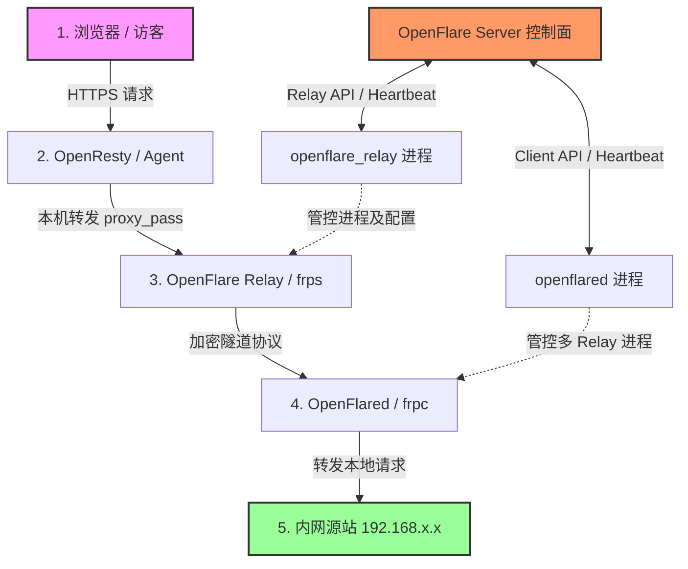

# 内网穿透隧道设计文档

你会学到：OpenFlare 内网穿透隧道的架构设计、双端管控组件（Relay 与 Client）的内部原理、交互逻辑以及数据面与控制面的通信流程。

---

## 需求分析

在典型的 Web 应用托管场景中，许多源站（Origin Server）部署在内网环境（如本地开发机、局域网服务器或受防火墙限制的内网集群）。这些服务器通常：
1. **无公网 IP**：无法直接被公网流量访问。
2. **安全合规限制**：不允许随意在边界路由器上配置端口映射（NAT）。
3. **动态 IP 变动**：传统的 DDNS 方案延迟高且极不稳定。

为了让内网源站能够无缝接入 OpenFlare 全局数据网关并享受 WAF 地域防护、TLS 证书托管等增值服务，OpenFlare 设计了基于 **反向中继穿透隧道** 的整体解决方案。在该架构中，公网边缘节点作为反代入口和流量中继，内网侧仅需发起安全出向连接，即可实现公网流量安全、稳定地反向穿透到内网源站。

---

## 核心功能

内网穿透隧道子系统包含以下核心能力：

* **Relay 节点动态管理**：由控制面动态派发中继服务（frps），动态分发服务端口与认证令牌（Token）。
* **多隧道反向代理映射**：支持在单个内网客户端上映射多个内网 Web 端口，并将多域名路由绑定至对应的中继节点。
* **独立进程生命周期管控**：中继与客户端均为 Go 编写的独立二进制守护进程，内部负责拉起、监控、自愈及热升级底层的 frp 引擎。
* **基于 Token 的独立认证隔离**：中继端使用 `agent_token`，内网客户端使用专属 `tunnel_token`，权限与路由边界隔离。
* **配置校验与增量热重载**：仅在隧道绑定关系、证书或 Relay 拓扑发生实际变化时，才重写配置文件并平滑重载进程，降低运行开销。

---

## 内网穿透与隧道架构

内网穿透子系统基于成熟的 `frp` 高性能隧道协议进行整合，分为 **控制面 (Control Plane)** 与 **数据面 (Data Plane)**。



* **控制面（Control Plane）**：Server 维护数据库状态；中继节点上的 `openflare_relay` 进程与内网服务器上的 `openflared` 进程通过 HTTP 心跳与 WebSocket 长通道同步隧道配置。
* **数据面（Data Plane）**：公网流量首先进入公网边缘的 Agent (OpenResty)，在此完成 HTTPS 握手、TLS 终止和 WAF 过滤，接着通过 `proxy_pass` 转发到同机部署的 `openflare_relay (frps)`。`frps` 再将请求封包通过与内网 `openflared (frpc)` 建立的持久隧道传输过去，最后由 `frpc` 拆包并分发给内网实际的源站服务。

---

## Relay (中继端) 设计

`openflare_relay` 是部署在公网边缘的中继管理器，运行在 `tunnel_relay` 类型的节点上。

### 1. 核心架构与逻辑
* **进程守护**：Relay 进程内部持有 `frps` 二进制，通过 `exec.Command` 拉起 `frps -c frps.toml` 子进程，并启动 goroutine 异步监听其退出状态。如果发现 `frps` 异常退出，会结合退避机制自动拉起。
* **动态配置渲染**：通过 HTTP 心跳向控制面同步状态，获取当前的 `RelayConfig`，主要参数包括：
  * `bindPort`：frps 用于监听内网 frpc 客户端连接的公网控制端口。
  * `vhostHTTPPort`：虚拟主机（Virtual Host）HTTP 流量监听端口，Agent 的 proxy_pass 会指向此端口。
  * `authToken`：客户端连接时进行握手校验的安全凭证。
  * `webServer`：开启 frps 的仪表盘 API，Relay 基于此接口或管理控制端口收集实时的活跃隧道数和流量指标。
* **状态上报**：Relay 每周期心跳会向控制面上报底层 `frps` 的活跃连接数、注册客户端数、各个代理通道的实时状态以及 Relay 版本。

---

## Openflared (客户端) 设计

`openflared` 是运行在用户内网服务器侧的客户端管理器，使用独立的 `tunnel_token` 进行鉴权。

### 1. 核心设计机制
* **多 Relay 支持（多路复用）**：
  为保障高可用或就近接入，控制面可能会将客户端连接调度到多个公网 Relay。`openflared` 会读取 `TunnelConfig` 中下发的 Relays 列表，在本地为每一个 Relay 节点独立生成一个专用的配置文件（命名为 `frpc_<relay_node_id>.toml`），并分别为每个 Relay 进程分配独立的 cancelable context。
* **子进程独立监控**：
  `openflared` 内部维护一个 `processes` 映射表，对每个 `frpc` 子进程进行独立的生命周期管控。当控制面增加或移除 Relay 时，客户端会增量拉起新进程或优雅注销老进程，避免影响其他正常工作的隧道。
* **动态 TOML 生成**：
  为每个 Relay 渲染 TOML 时，客户端会遍历 Proxies 列表，将每个内网服务的 `LocalAddr`、`LocalPort`、绑定的 `CustomDomains` 写入到 `[[proxies]]` 块中。

---

## 交互逻辑与流量模型

内网穿透子系统实现了一致性版本控制和状态反馈。

### 1. 控制面发布与同步流程

```text
管理员修改隧道/内网端口映射 -> 提交发布 -> 生成新 Tunnel 版本与 Checksum
                                            |
                                            v (推送或心跳拉取)
+-------------------------------------------+-------------------------------------------+
|                                                                                       |
v (中继端)                                                                               v (内网客户端)
openflare_relay 心跳检测到 frps 端口/Token 变化                                          openflared 心跳检测到 tunnel_version 发生变更
重新渲染本地 frps.toml                                                                   请求拉取最新代理映射包
Kill 并重新拉起 frps 进程                                                               重新渲染 frpc_<relay_id>.toml
上报健康状态为 healthy                                                                   对有变更的 Relay 进程执行重启与配置热重载
                                                                                        上报应用结果 (Apply Success/Error)
```

1. **版本化控制**：所有内网隧道的路由和映射关系与主路由系统类似，也经过版本化控制，下发 `version` 与 `checksum`，确保客户端不重复写入和频繁重载进程。
2. **应用结果闭环**：客户端应用新配置后，会在心跳中携带应用结果上报控制面。若因内网端口不可达或证书配置有误导致 frpc 无法建连，客户端会截获进程输出将 `LastError` 上报，管理员在 Server 即可直观查看穿透失败原因。

### 2. 数据面流量模型
1. **公网入口 (Agent)**：
   ```nginx
   server {
       listen 443 ssl;
       server_name intranet.example.com;
       # ... TLS 证书与 WAF 过滤逻辑 ...
       location / {
           proxy_pass http://127.0.0.1:18080; # 指向本地 frps 的虚拟主机端口
           proxy_set_header Host $host; # 必须保留原 Host，因为 frps 依靠 Host 进行内部路由分发
           proxy_set_header X-Real-IP $remote_addr;
       }
   }
   ```
2. **中继节点 (frps)**：
   `frps` 监听到 `18080` 端口有 HTTP 请求进来，读取 HTTP 请求头中的 `Host: intranet.example.com`，在其已注册的活跃隧道表中检索该域名对应的加密 TCP 连接（由内网 frpc 建立）。
3. **加密隧道传输 (TCP)**：
   `frps` 将 HTTP 请求封装进内部 TCP 隧道协议，发送给内网的 `frpc` 客户端。
4. **内网客户端分发 (frpc)**：
   `openflared` 管理的 `frpc` 收到封包，根据本地配置（`localIP = "127.0.0.1"`, `localPort = 8080`）将请求建立本地 TCP 连接转发给内网 Web 服务，并将 Web 服务的响应原路打包返回，最终呈现给公网用户。
