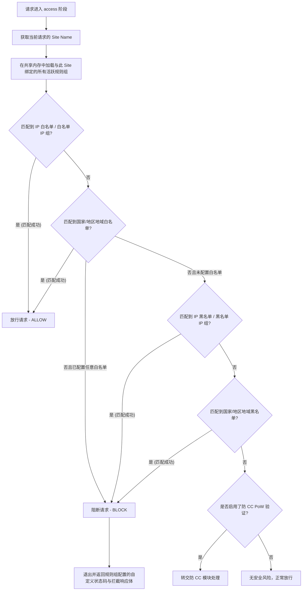

# WAF 设计文档

你会学到：OpenFlare 边缘 Web 应用防火墙（WAF）的核心架构、动态 IP 组异步差分同步模型、OpenResty Lua 高性能缓存方案以及完整的请求过滤与判定逻辑。

---

## 需求分析

在互联网公开环境中，Web 应用程序面临着各种各样的安全威胁（如扫描器踩点、刷接口、针对特定地域的恶意网络爬虫、勒索攻击及 CC 攻击等）。如果直接把恶意请求放行给源站（Origin Server），会导致：
1. **源站负载飙升**：高频的数据库查询与 CPU 运算极易耗尽服务器资源。
2. **敏感接口被刷**：登录、注册、短信验证码接口容易被恶意滥用导致财产损失。
3. **数据泄露风险**：恶意的通用漏洞探测行为无法被提前拦截。

因此，OpenFlare 需要在最前端的数据面（OpenResty）构建一套 **高性能、可弹性伸缩的 WAF 过滤引擎**。该引擎能够在最接近用户的边缘层以毫秒级的极低开销对恶意请求进行深度过滤，减轻源站压力，并提供防 CC（PoW 挑战）、IP 黑白名单与地域级别拦截等核心安全防护能力。

---

## 核心功能

OpenFlare WAF 包含以下核心防护维度：

* **IP 级拦截（IP 黑白名单）**：支持单 IP、CIDR 网段过滤，支持将上万 IP 聚合为 IP 组进行高效比对。
* **地域黑白名单（GeoIP 限制）**：集成 MaxMind 数据库，支持针对国家（Country）和省份/地区（Region）执行精准准入控制。
* **自定义拦截响应**：支持针对不同的过滤规则自定义阻断状态码（如 403, 418）以及个性化的 HTML 拦截页面。
* **人机挑战（PoW CC 防护）**：支持无感人机挑战，通过计算 Hash 碰撞防止自动化脚本和僵尸网络（Botnet）对接口进行并发冲击。

---

## IP 组设计与动态异步同步

IP 组是 WAF 进行高效黑白名单管控的核心容器。OpenFlare 将 IP 组根据更新频率与产生渠道分为三类：

### 1. IP 组类型
* **手动 IP 组（Manual）**：由管理员在控制面板上手动输入 IP 或 CIDR 列表。主要用于静态的信任 IP 或长期的封禁。
* **订阅 IP 组（Subscription）**：配置远程文本（按行分隔）或标准的 JSON 订阅地址。Server 侧的定时任务会周期性抓取远程订阅源并自动解析导入。主要用于集成开源的威胁情报库、云厂商的 IP 范围等。
* **自动 IP 组（Automatic）**：**最具弹性的动态防护通道**。控制面的定时扫描任务会读取所有节点的访问日志，按照设定的 Expr 规则（例如：“5分钟内请求 `/api/login` 接口触发 401 超过 50 次”）进行聚合分析，一旦匹配，自动将该恶意源 IP 写入封禁组，并指定封禁时长。

### 2. 异步差分同步设计 (不触发 Nginx Reload)
在传统的 Nginx WAF 设计中，IP 黑名单的更新通常需要重写配置并 reload。如果恶意 IP 封禁以秒级或分钟级高频触发，频繁 reload 会导致 Nginx 频繁新建 Worker 进程并销毁老进程，导致性能骤降。

OpenFlare 采用 **动态 IP 组异步差分同步设计**：

```text
WAF IP 成员更新 (手动/订阅/自动自动触发)
        |
        v
Server 更新数据库并计算该 IP 组的全新 MD5 Checksum
        |
        +----------------------------------------+
        | (WebSocket 实时广播)                   | (心跳兜底比对)
        v                                        v
Server 立即向所有 Agent 推送变更组的完整成员       Agent 心跳上报本地所有 IP 组的 Checksum 映射表
        |                                        |
        |                                        v
        |                                Server 发现 Checksum 不一致，下发变更的 IP 组成员
        v                                        |
Agent 接收成员数据，将其以 JSON 形式写入本地磁盘路径：waf_ip_groups.json
        |
        v (Lua 内存感知)
OpenResty Lua 引擎通过 MD5 校验和秒级感知文件变化并热更新内存，无需 reload 进程
```

通过这一架构，上万个高频变动的动态黑名单 IP 的落地和生效，**全程无需 reload 任何 Nginx 进程**，极大地保护了网关的高并发性能。

---

## 规则组与网站绑定

* **WAF 规则组（Rule Group）**：WAF 过滤政策的最小逻辑集合。一条规则组内可以包含 IP 黑白名单、IP 组引用、地域限制及防 CC 挑战配置。
* **全局规则组（Global）**：当规则组被标记为 `is_global = true` 时，该规则组对节点上托管的**所有网站路由**默认生效。
* **网站绑定绑定（Site Binding）**：网站路由（Proxy Route）可以绑定一个或多个非全局规则组。判定时，会执行 `全局规则组 + 绑定规则组` 的并集逻辑。

---

## 实现方案与高性能缓存

WAF 在 OpenResty 的 `access_by_lua` 阶段被触发，核心由 Lua 文件与本地落地的 JSON 配置构成。

### 1. 物理结构
* `waf_config.json`：包含所有规则组的元数据、国家地域限制、以及网站（Site）与规则组的关联映射。
* `waf_ip_groups.json`：包含所有同步下来的 IP 组与对应的 IP 列表。
* `waf/runtime.lua`：WAF 规则比对的实际运行时引擎。
* `waf/check.lua`：接入层入口，负责包引入与 check() 触发。

### 2. 共享内存字典 (ngx.shared) 高性能缓存设计
在每次 Web 请求进来时都读取磁盘上的 JSON 文件并进行解码，会导致磁盘 I/O 成为严重的性能瓶颈。

OpenFlare 利用 **OpenResty 共享内存字典 (ngx.shared.openflare_waf_config)** 设计了二级缓存机制：

1. **零文件 I/O 路径**：
   在 Lua 中，每次执行 `check()` 时，首先利用 `ngx.md5` 瞬间计算本地磁盘 JSON 文件的 MD5 哈希（这一操作几乎为零耗时，因为文件已被操作系统 Page Cache 缓存）。
2. **哈希比对与热加载**：
   比对共享内存中存储的缓存哈希键（`_config_hash`）。
   * **若哈希未发生变化**：直接从共享内存字典中读取已解码、存在内存中的 Lua Table 配置，整个校验过程完全基于**共享内存操作**，耗时在 **微秒级** 级别。
   * **若哈希不一致**：说明 Agent 刚刚落地了新的 WAF 规则或 IP 组，Lua 自动读取磁盘文件并使用 `cjson.decode` 解码，解码后的数据及全新的 MD5 写入共享内存，供后续 Worker 进程无缝读取。

---

## 应用流程与判定判定控制逻辑

当一个 HTTP/HTTPS 请求到达 OpenResty 后，WAF 会在 `access` 阶段按下图所示的漏斗判决链进行逐步匹配拦截：

### 1. WAF 判定流程图



### 2. 判决步骤细则
1. **白名单前置**：
   为了防止误杀以及保障核心回源流量（如搜索引擎蜘蛛、CDN 回源 IP、办公区出口）的顺畅，WAF **优先匹配 IP 白名单与地域白名单**。一旦白名单匹配成功，直接绕过后续的所有黑名单检测和 CC 挑战，立刻放行。只要当前生效规则组配置了任意白名单，请求未命中全部白名单时会被拦截，白名单在这种情况下表现为准入名单。
2. **黑名单强力阻断**：
   如果在白名单判定中未被捕获，请求将进入黑名单漏斗。一旦请求源 IP 命中 IP 黑名单、命中引用的黑名单 IP 组、或是处于被禁止的国家/地区范围内，Lua 引擎立即将 `ngx.ctx.openflare_waf_blocked` 标记设为 `true`。
3. **输出响应**：
   命中黑名单后，Lua 提取匹配到规则组的 `block_status_code`（默认返回 418 / 403）和 `block_response_body`（拦截页面 HTML），通过 `ngx.say()` 输出响应体并执行 `ngx.exit(status)` 平滑退出请求，防止请求继续向后透传。
