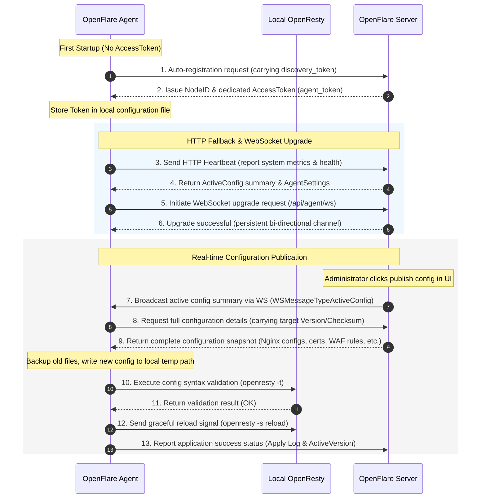
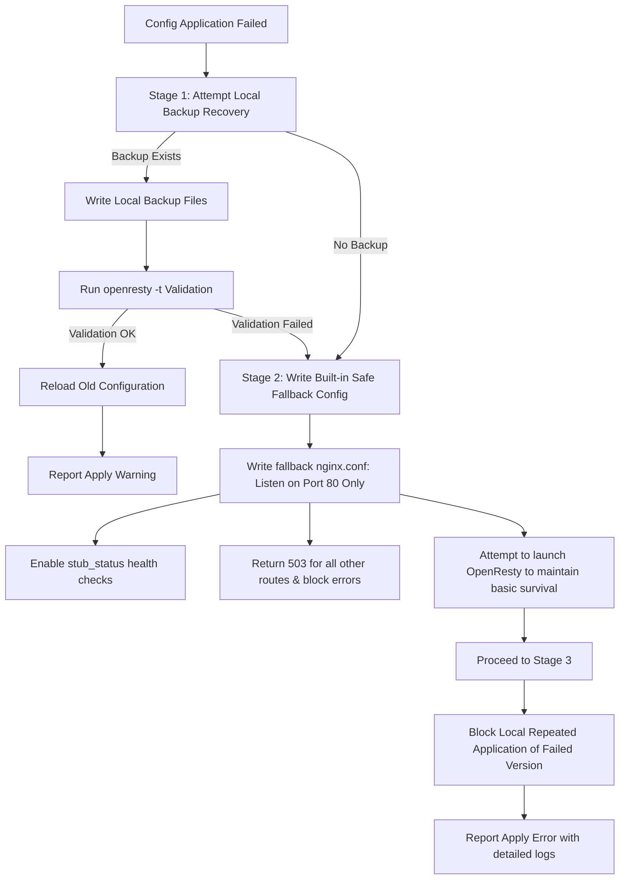

# Agent Design Document

You will learn: Agent design principles, core functional modules, interaction links with the Server, and how configuration applications are secured and made reliable through immutable version models and the three-stage disaster recovery rollback mechanism.

---

## Requirements Analysis

In distributed reverse proxy and edge security gateway scenarios, the Agent plays a central role in connecting the control plane (Server) and the data plane (OpenResty). Since the Agent runs on the user's actual node server, its design must adhere to the following core security and high-availability requirements:

1. **Active Pull (Pull Model) instead of Push**: The Server does not hold the SSH keys of the nodes, nor does it actively initiate inbound connections to the nodes. All control directives and configuration updates are actively pulled by the Agent via heartbeats or long-lived connections (WebSockets). This eliminates inbound firewall security risks on the node side and prevents control channels from being hijacked.
2. **Minimal Intrusiveness**: The Agent runs as an independent Go binary process. It only interacts with the local OpenResty process through file-based configuration rewriting and signal notifications, without interfering with other system services on the node.
3. **Robust Disaster Recovery & Self-Healing**: Since network jitter, disk exhaustion, or erroneous configurations can easily lead to configuration sync failures, the Agent must possess zero-dependency local rollback and self-healing capabilities, strictly preventing a single configuration error from causing a complete node outage.
4. **Pure Data and State Landing**: The Agent is only responsible for executing file generation and control intentions rendered by the Server. It does not carry complex control plane duties like business logic validation or multi-tenant authorization, ensuring the node side remains highly efficient and lightweight.

---

## Core Capabilities

The Agent is composed of the following core sub-modules, cooperating to manage its complete lifecycle:

| Module Name | Directory | Responsibilities |
| :--- | :--- | :--- |
| **Config Sync** | `sync/` | Pulls full configuration packages, writes files, triggers reloads, and records and reports sync statuses. |
| **Heartbeat** | `heartbeat/` | Periodically reports node health and resource metrics to the Server and retrieves the latest active version summary. |
| **WebSocket** | `wsclient/` | Maintains a persistent connection with the Server, providing sub-second real-time configuration pushes and commands. |
| **OpenResty Control** | `nginx/` | Executes Nginx config validation (`openresty -t`), rewrites, graceful reloads (`reload`), and process auto-start. |
| **Local State Store** | `state/` | Persistently records local applied versions, error logs, and buffers unsent observability metrics. |
| **Self-Updater** | `updater/` | Listens to Server self-update commands, securely pulls new binary versions, and completes in-place upgrades. |
| **Observability** | `observability/` | Collects host CPU/memory/disk and Nginx performance metrics, processes access logs, and uploads them. |
| **GeoIP Maintenance** | `geoipdata/` `geoipupdate/` | Maintains and updates the local GeoIP database periodically to support WAF country-level filtering. |

---

## Interaction Flows with Server

The Agent communicates with the control plane through **Token-based Auto-Registration** and a **Dual-channel Heartbeat/WebSocket** system during its lifecycle.

### 1. Auto-Registration Flow

If the Agent starts with an empty `access_token` in its local `agent.json`, but has a `discovery_token` configured, it triggers the auto-registration flow:
1. The Agent sends a registration request to `/api/agent/register`, carrying a local hardware fingerprint, IP, and hostname.
2. After validating the `discovery_token`, the Server generates a unique `NodeID` and a dedicated `AccessToken` (i.e., `agent_token`) in the database and returns them.
3. The Agent writes the dedicated Token to its local configuration file, clears the one-time `discovery_token`, and uses the `AccessToken` for all subsequent authenticated communications.

### 2. Dual-Channel Heartbeat & Sync Mechanism

* **HTTP Polling (Fallback and Detection)**: The Agent sends POST heartbeat packets at configured `heartbeat_interval` intervals by default. It reports health metrics while retrieving the currently active configuration version summary (Version & Checksum).
* **WebSocket Channel (Real-time Communication)**: Upon a successful HTTP heartbeat, the Agent automatically attempts to upgrade the connection to WebSocket (`/api/agent/ws`).
  * Once the WS connection is established, heartbeats and metrics reporting shift entirely to the WS pipeline, reducing network overhead.
  * When the Server publishes or activates a new version, it broadcasts a notification to the Agent via WS. The Agent triggers the synchronization flow **immediately** upon receiving the change event, achieving sub-second configuration deployment.
  * If the WS connection drops due to network issues, the Agent automatically falls back to HTTP polling and uses an exponential backoff algorithm to attempt rebuilding the WS channel.

### 3. Interaction Sequence Diagram



---

## Control of OpenResty

The Agent implements end-to-end closed-loop control of the data plane OpenResty, including configuration rendering, syntax validation, graceful reloading, and exception state capturing:

### 1. Configuration Layout on Disk

Upon successful sync, the Agent writes configuration files to `/etc/nginx/openflare-lua/` (or the configured `LuaDir`) according to a strict physical structure:
* `nginx.conf`: Main configuration file (replaces absolute path placeholders, configures performance parameters, shared dictionaries, and global server blocks).
* `routes.conf`: Route configuration file (generated by the Agent, containing all website server blocks, certificate paths, cache settings, and rate limit directives).
* `certs/`: Certificate storage directory (files named as `{cert_id}.crt` and `{cert_id}.key`).
* `waf/` and `pow/`: Dedicated Lua runtime scripts required for WAF and CC mitigation.
* `waf_config.json` and `waf_ip_groups.json`: Structured rules and IP databases required by the WAF filtering engine.

### 2. Refined Reload Operations

1. **Backup Current Config**: Before writing new files, the Agent copies the existing configuration files to a `.backup` directory, keeping a complete rollback snapshot.
2. **Write and Replace Placeholders**: Writes the pulled templates, automatically replacing absolute path placeholders (e.g., `__OPENFLARE_LUA_DIR__`) with actual local execution paths.
3. **Syntax Validation**: Calls `openresty -t -c <temp_nginx.conf>` to run a strict syntax test.
4. **Graceful Reload**: If validation passes, the Agent moves the files to the official paths and executes `openresty -s reload`. If OpenResty is not running, it launches the process.
5. **Exception Capture**: If validation or reload fails, the Agent intercepts the standard error output (stderr) and extracts the first 2000 characters of the detailed error log.

---

## Publishing & Config Application Model

OpenFlare discards the fragile mechanism of dynamically patching node configurations, instead using an **immutable configuration version publishing model**.

```text
Edit rules -> Preview / View diff -> Publish -> Generate full configuration version -> Activate version -> Agent pulls -> Local application -> Report result
```

### 1. Core Design Principles

* **Complete Publication**: Every publication compiles all enabled proxy routes, certificates, and global/custom WAF rules at once, generating a complete version package with a unique `checksum`.
* **Version Format**: Uses the `YYYYMMDD-NNN` incremental format, ensuring version histories are intuitive and strictly monotonic.
* **Global Single Active Version**: The system supports only one globally `active` configuration version at any given time. Rollbacks do not require reverse patching; they simply transition an older healthy version to the `active` state, and the Agent pulls and applies it.

### 2. Three-Stage Disaster Recovery & Rollback Mechanism

If the Agent fails to apply a configuration (or reload fails), it automatically triggers the following three-stage self-healing pipeline:



1. **Stage 1: Local Backup Rollback**
   * The Agent attempts to restore the main configuration, routes, and certificates from the `.backup` directory.
   * It runs `openresty -t` validation on the restored backup. If successful, it reloads and reports a `Warning` to the Server (Warning: failed to apply new version, automatically rolled back to the previous healthy version).
2. **Stage 2: Built-in Safe Fallback Runtime**
   * If no local backup exists (e.g., first deployment failed) or if the rollback validation fails, the Agent activates the ultimate self-healing mechanism: writing a **built-in safe fallback configuration**.
   * **Fallback Configuration Specification**:
     * Listens only on port `80`, containing no real user reverse proxy routes.
     * The `/openflare/stub_status` endpoint returns a healthy response, while all other requests uniformly return a `503 Service Unavailable` status code with the fixed response body `OpenFlare: No Valid Configuration`.
     * It attempts to launch OpenResty with this minimal configuration. This keeps the Nginx process alive, preserving underlying health probes and metric endpoints, preventing containers/pods from being repeatedly killed and restarted by orchestration systems, while keeping sensitive routes secure.
3. **Stage 3: Local Configuration Blocking**
   * The Agent records the failing configuration's `version + checksum` in its local state store blacklist.
   * Until the control plane activates a new configuration (resulting in a changed `checksum`), the Agent's heartbeat blocks repeated synchronization pulls of this erroneous version, preventing nodes from entering an infinite loop of "heartbeat -> pull failing config -> crash rollback".

### 3. WAF IP Group Asynchronous Runtime Synchronization

To prevent highly volatile IP blacklists from triggering frequent full config publications and Nginx reloads (which still incur minor CPU and connection overhead), WAF IP groups are synchronized via an **asynchronous differential sync design**:

* **Static Publication Snapshot**: The `waf_config.json` generated upon publication only contains the group ID reference mapping (i.e., `ip_whitelist_group_ids` / `ip_blacklist_group_ids`) and does not contain the actual list of IP addresses.
* **Heartbeat Differential Check**: The Agent uploads its locally cached IP groups MD5 checksum map in its heartbeat.
* **Differential Delivery**: The Server compares checksums and only delivers missing or modified IP groups, which are written directly to `waf_ip_groups.json` on the node without reload.
* **WebSocket Real-time Push**: When an administrator updates an IP group, or a threat intelligence subscription successfully pulls, or a security rule triggers a temporary block, the Server immediately broadcasts the IP group update package via WebSocket. The Agent receives and applies it instantly **without Nginx reloads**.

---

## Design Constraints

To protect the security boundary of the data and control plane, Agent development must strictly comply with the following engineering constraints:

1. **Zero-Privilege Command Execution**: The Server is strictly prohibited from sending any arbitrary shell commands or scripts to the Agent (such as exec/eval). All system control operations (such as start, stop, reload, update) must be hardcoded inside the Agent binary.
2. **Strict Token Filtering and Prefix Validation**: Agent requests to the Server must be prefixed with `/api/agent/` and must carry the `X-Agent-Token` header for signature or token verification.
3. **Node Autonomy**: The Agent must support complete offline capabilities. During disconnected periods, the local OpenResty must rely on local configuration copies to keep reverse proxy services running normally.
