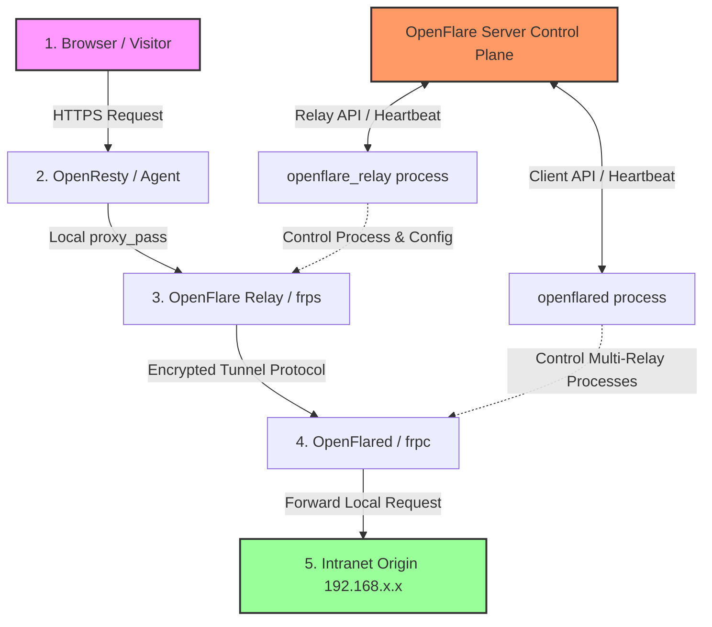

# Intranet Penetration Tunnel Design Document

You will learn: The architectural design of the OpenFlare intranet penetration tunnel, the internal principles of the dual-ended control components (Relay and Client), their interaction logics, and the communication flows for the data plane and control plane.

---

## Requirements Analysis

In typical web application hosting scenarios, many origin servers (Origin Servers) are deployed in local intranet environments (such as local development machines, LAN servers, or firewalled private clusters). These servers typically suffer from:
1. **No Public IP**: Cannot be directly accessed by public internet traffic.
2. **Security Compliance Restrictions**: Creating port mappings (NAT) on border routers is strictly prohibited by security policies.
3. **Dynamic IP Changes**: Traditional DDNS solutions exhibit high latency and are highly unstable.

To allow internal origin servers to seamlessly integrate into the OpenFlare global data gateway, benefiting from premium features like WAF geographic protection and TLS certificate hosting, OpenFlare designed an end-to-end solution based on a **reverse relay penetration tunnel**. In this architecture, public edge nodes act as reverse proxy entrances and traffic relays, while the intranet side only needs to initiate secure outbound connections to achieve secure and stable reverse penetration of public traffic to internal origin servers.

---

## Core Capabilities

The intranet penetration tunnel subsystem includes the following core capabilities:

* **Dynamic Relay Node Management**: The control plane dynamically dispatches relay services (frps), distributing service ports and authentication tokens dynamically.
* **Multi-Tunnel Reverse Proxy Mapping**: Supports mapping multiple internal web ports on a single intranet client, binding multiple domain routes to corresponding relay nodes.
* **Independent Process Lifecycle Control**: Both the relay and client are independent daemon processes written in Go, responsible for spawning, monitoring, self-healing, and hot-upgrading the underlying frp engine.
* **Token-based Independent Authentication**: The relay uses `agent_token` for authorization, whereas the intranet client uses its dedicated `tunnel_token`, enforcing isolation of permissions and routing boundaries.
* **Validation & Incremental Hot Reload**: Config files are rewritten and processes are gracefully reloaded only when tunnel bindings, certificates, or Relay topologies change, reducing runtime overhead.

---

## Intranet Penetration & Tunnel Architecture

The intranet penetration subsystem is integrated on top of the mature and high-performance `frp` tunnel protocol, divided into the **Control Plane** and the **Data Plane**.



* **Control Plane**: The Server maintains the database state. The `openflare_relay` process on relay nodes and the `openflared` process on intranet servers synchronize tunnel configurations via HTTP heartbeats and long-lived WebSocket connections.
* **Data Plane**: Public traffic enters the public edge Agent (OpenResty), where the TLS handshake, HTTPS termination, and WAF filtering are executed. It is then forwarded via `proxy_pass` to the co-located `openflare_relay (frps)` on the loopback address. `frps` encapsulates the HTTP requests into the encrypted TCP tunnel and sends them down to the intranet `openflared (frpc)`. Finally, `frpc` unpacks the requests and forwards them to the actual intranet origin service.

---

## Relay (Server-side) Design

`openflare_relay` is a relay manager deployed on the public edge, running on nodes of type `tunnel_relay`.

### 1. Core Architecture & Logic
* **Process Daemon**: The Relay process embeds the `frps` binary, spawning the `frps -c frps.toml` subprocess via `exec.Command` and using goroutines to asynchronously listen to its exit status. If `frps` exits unexpectedly, it automatically restarts using an exponential backoff policy.
* **Dynamic Configuration Rendering**: Periodically synchronizes status with the control plane via HTTP heartbeats to retrieve the active `RelayConfig`, including:
  * `bindPort`: The public control port that frps listens to for incoming intranet frpc connections.
  * `vhostHTTPPort`: The virtual host HTTP listening port where the Agent's proxy_pass points.
  * `authToken`: The security credential used during the client connection handshake.
  * `webServer`: Enables the frps dashboard API, which the Relay queries to collect active tunnel counts and traffic metrics.
* **Status Reporting**: In each heartbeat cycle, the Relay reports the active connections, registered clients, individual proxy tunnel statuses, and Relay version back to the Server.

---

## Openflared (Client-side) Design

`openflared` is the client manager running inside the user's intranet server, authenticated using a dedicated `tunnel_token`.

### 1. Core Design Mechanisms
* **Multi-Relay Support (Multiplexing)**:
  To guarantee high availability and geographical proximity, the control plane may schedule the client to connect to multiple public Relays. `openflared` parses the list of Relays dispatched in the `TunnelConfig`, generating dedicated configurations (`frpc_<relay_node_id>.toml`) and allocating distinct cancelable contexts for each Relay process locally.
* **Independent Subprocess Monitoring**:
  `openflared` maintains a local `processes` map to manage the lifecycles of individual `frpc` subprocesses. When the control plane adds or removes Relays, the client incrementally spawns new processes or gracefully shuts down obsolete ones without affecting other functioning tunnels.
* **Dynamic TOML Generation**:
  When rendering TOML configs for each Relay, the client iterates over the Proxies list, writing each intranet service's `LocalAddr`, `LocalPort`, and bound `CustomDomains` into standard `[[proxies]]` blocks.

---

## Interaction Logic & Traffic Model

The intranet penetration subsystem implements consistent version control and status feedback loops.

### 1. Control Plane Publishing & Sync Flow

```text
Admin modifies tunnel/intranet port mappings -> Click Publish -> Generate new Tunnel version & Checksum
                                                                        |
                                                                        v (Push or Heartbeat Pull)
+-----------------------------------------------------------------------+-----------------------------------------------------------------------+
|                                                                                                                                               |
v (Relay Side)                                                                                                                                  v (Client Side)
openflare_relay heartbeat detects frps port/Token change                                                                                        openflared heartbeat detects tunnel_version change
Re-render local frps.toml                                                                                                                       Request full proxy configuration details
Kill and restart the frps process                                                                                                               Re-render frpc_<relay_id>.toml configs
Report health status as healthy                                                                                                                 Restart or hot-reload changed frpc processes
                                                                                                                                                Report application results (Apply Success/Error)
```

1. **Versioned Controls**: All intranet tunnel routes and mapping relationships are version-controlled, dispatching a unique `version` and `checksum` to ensure clients do not repeatedly write files or trigger redundant reloads.
2. **Closed-Loop Application Feedback**: After applying new configurations, the client reports the application result in the next heartbeat. If the intranet port is unreachable or certificate bindings fail, the client intercepts the stdout/stderr of the subprocess to report `LastError` to the Server, providing administrators with transparent error details.

### 2. Data Plane Traffic Model
1. **Public Entrance (Agent)**:
   ```nginx
   server {
       listen 443 ssl;
       server_name intranet.example.com;
       # ... TLS certificates & WAF filtering ...
       location / {
           proxy_pass http://127.0.0.1:18080; # Points to local frps vhost port
           proxy_set_header Host $host; # Must preserve the original Host header, which frps relies on to route requests
           proxy_set_header X-Real-IP $remote_addr;
       }
   }
   ```
2. **Relay Node (frps)**:
   `frps` listens to the Vhost port `18080`. When an HTTP request arrives, it extracts `Host: intranet.example.com` from the request headers and searches its active registered tunnel registry to locate the matching encrypted TCP connection (initiated by the intranet frpc).
3. **Encrypted Tunnel Transmission (TCP)**:
   `frps` encapsulates the HTTP request into the custom TCP tunnel protocol and transmits it down to the intranet `frpc` client.
4. **Intranet Client Distribution (frpc)**:
   The `frpc` instance managed by `openflared` receives the payload, resolves it according to local settings (`localIP = "127.0.0.1"`, `localPort = 8080`), initiates a local TCP connection to forward the request to the intranet web service, and returns the response back through the tunnel to the public viewer.
