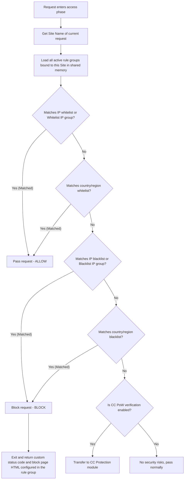

# WAF Design Document

You will learn: The core architecture of the OpenFlare edge Web Application Firewall (WAF), the dynamic IP group asynchronous differential sync model, the high-performance OpenResty Lua caching scheme, and the complete request filtering and decision logic.

---

## Requirements Analysis

In public internet environments, web applications face a wide variety of security threats (such as scanner profiling, api scraping, malicious botnets targeted at specific regions, ransomware, and CC attacks). Allowing malicious requests to pass directly to the origin server (Origin Server) results in:
1. **Origin Server Overload**: High-frequency database queries and intensive CPU computations easily exhaust server resources.
2. **Sensitive API Abuse**: APIs like login, registration, and SMS verification codes can be maliciously exploited, leading to financial and computational losses.
3. **Data Exposure Risks**: Malicious common vulnerability probing actions are not intercepted proactively.

Therefore, OpenFlare needs to build a **high-performance, resiliently scalable WAF filtering engine** at the frontmost data plane layer (OpenResty). This engine is capable of executing deep filtering on malicious requests at the edge layer closest to users with sub-millisecond overhead. This relieves pressure on origin servers and provides core security capabilities like CC protection (PoW challenge), IP whitelisting/blacklisting, and region-level interception.

---

## Core Capabilities

OpenFlare WAF includes the following core protection dimensions:

* **IP Interception (IP Whitelist/Blacklist)**: Supports filtering by single IP or CIDR block, and aggregating tens of thousands of IPs into IP groups for highly efficient matching.
* **Geographical Whitelist/Blacklist (GeoIP Limit)**: Integrates MaxMind databases to support precise admission controls based on countries and provinces/regions.
* **Custom Interception Responses**: Supports custom block status codes (e.g., 403, 418) and personalized HTML block pages for different filtering rules.
* **Human-Machine Challenge (PoW CC Protection)**: Supports seamless client-side PoW challenges, calculating Hash collisions to prevent automated scripts and botnets from hitting endpoints concurrently.

---

## IP Group Design & Dynamic Asynchronous Sync

IP groups are the core containers for highly efficient IP whitelisting and blacklisting. OpenFlare classifies IP groups into three types based on their update frequencies and source channels:

### 1. IP Group Types
* **Manual**: Manually input by administrators in the control panel. Primarily used for static trusted IPs or long-term blocks.
* **Subscription**: Configured with remote text feeds (one IP/CIDR per line) or standard JSON subscription URLs. Server-side cron jobs periodically fetch and parse the remote subscription sources. Primarily used for integrating open-source threat intelligence feeds, cloud provider IP ranges, etc.
* **Automatic**: **The most resilient dynamic protection channel**. Control plane scanning jobs read access logs from all nodes, performing aggregation and analysis based on configured Expr rules (e.g., "requesting the `/api/login` endpoint over 50 times with a 401 status code in 5 minutes"). Once matched, the source IP is automatically added to a temporary block list for a specified duration.

### 2. Asynchronous Differential Sync Design (No Nginx Reload)
In traditional Nginx WAF designs, IP blacklist updates typically require writing configurations and executing reloads. If malicious IP blocks occur at high frequencies (seconds or minutes), frequent reloads force Nginx to constantly spawn new worker processes and tear down old ones, severely degrading performance.

OpenFlare adopts a **dynamic IP group asynchronous differential sync design**:

```text
WAF IP member updates (Manual/Subscription/Auto-trigger)
        |
        v
Server updates the database and calculates the new MD5 Checksum of the IP group
        |
        +----------------------------------------+
        | (WebSocket Real-time Broadcast)        | (Heartbeat Fallback Comparison)
        v                                        v
Server immediately pushes complete members        Agent heartbeats report the local IP groups
of modified groups to all Agents                  checksum mapping table
        |                                        |
        |                                        v
        |                                Server detects Checksum mismatch and dispatches
        v                                the modified IP group members
Agent receives member data and writes it as JSON to local disk: waf_ip_groups.json
        |
        v (Lua Memory Awareness)
OpenResty Lua engine detects file changes via MD5 checksum in seconds and hot-updates its memory,
completely bypassing Nginx process reloads.
```

Through this architecture, the persistence and activation of tens of thousands of highly volatile dynamic blacklist IPs **require absolutely no Nginx reloads**, maximally protecting the high-concurrency throughput of the gateway.

---

## Rule Groups & Site Bindings

* **WAF Rule Group**: The smallest logical collection of WAF filtering policies. A single rule group can contain IP whitelists/blacklists, IP group references, regional restrictions, and CC protection configurations.
* **Global Rule Group**: When a rule group is marked as `is_global = true`, it takes effect on **all website routes** hosted on the node by default.
* **Site Binding**: Website routes (`proxy_routes`) can bind one or more non-global rule groups. During request validation, WAF evaluates the union of `Global Rule Group + Bound Rule Groups`.

---

## Implementation Details & High-Performance Caching

WAF is triggered in the OpenResty `access_by_lua` phase, implemented primarily through Lua files and local JSON configurations.

### 1. Physical Structures
* `waf_config.json`: Contains metadata for all rule groups, geographic country/region limits, and website-to-rule-group bindings.
* `waf_ip_groups.json`: Contains all synchronized IP groups and their corresponding IP lists.
* `waf/runtime.lua`: The actual runtime engine responsible for WAF rule comparison.
* `waf/check.lua`: The entry point for the access layer, handling packages inclusion and triggering `check()`.

### 2. Shared Memory Dictionary (ngx.shared) High-Performance Cache Design
Reading JSON files from the disk and decoding them upon every incoming web request would make disk I/O a severe performance bottleneck.

OpenFlare leverages the **OpenResty Shared Memory Dictionary (ngx.shared.openflare_waf_config)** to implement a two-level caching mechanism:

1. **Zero File I/O Path**:
   In Lua, every time `check()` executes, it first computes the MD5 hash of the local JSON file using `ngx.md5` (which takes virtually zero time since the file is cached in the OS Page Cache).
2. **Hash Comparison & Hot Loading**:
   It compares this against the cached hash key (`_config_hash`) stored in the shared memory dictionary.
   * **If the hash is unchanged**: It reads the pre-decoded Lua Table configuration stored directly in shared memory. The entire verification runs purely in **shared memory**, completing in **microseconds**.
   * **If the hash is mismatched**: Indicating that the Agent has just updated the WAF rules or IP groups on the disk, the Lua engine automatically reads the disk file, decodes it via `cjson.decode`, writes the decoded data and the new MD5 hash into shared memory, and makes it seamlessly readable by all subsequent worker processes.

---

## Application Flow & Decision Judgment Control Logic

When an HTTP/HTTPS request arrives at OpenResty, WAF evaluates and intercepts it step-by-step in the `access` phase according to the funnel decision chain below:

### 1. WAF Decision Flowchart



### 2. Decision Step Details
1. **Whitelist Precedence**:
   To prevent false positives and guarantee smooth passage of core back-to-source traffic (such as search engine spiders, CDN back-to-source IPs, and office egresses), WAF **prioritizes matching IP whitelists and regional whitelists**. Once a whitelist matches, it immediately bypasses all subsequent blacklist checks and CC challenges.
2. **Blacklist Aggressive Block**:
   If a request is not captured by the whitelist evaluation, it enters the blacklist funnel. Once the source IP matches an IP blacklist, a referenced blacklist IP group, or lies within a prohibited country/region, the Lua engine immediately marks `ngx.ctx.openflare_waf_blocked` as `true`.
3. **Response Output**:
   Upon hitting the blacklist, Lua extracts the `block_status_code` (defaults to 418 or 403) and `block_response_body` (interception HTML page) configured in the matching rule group. It outputs the response body via `ngx.say()` and gracefully terminates the request using `ngx.exit(status)` to prevent the request from passing upstream.
