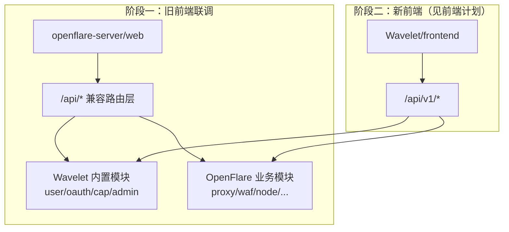
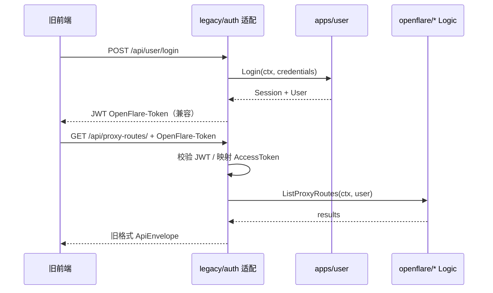

# OpenFlare → Wavelet 后端迁移计划

> **文档类型**：实现计划（Implementation Plan）  
> **创建日期**：2026-06-18  
> **状态**：规划中  
> **前置阅读**：[`Wavelet/AGENTS.md`](../../Wavelet/AGENTS.md)、[`docs/guideline/Constraints.md`](../guideline/Constraints.md)、[`docs/design/architecture.md`](../design/architecture.md)

---

## 1. 目标与背景

### 1.1 需求背景

OpenFlare 当前控制面基于 `openflare-server`（Gin + GORM 单体），与 Wavelet 全栈脚手架在认证、任务、配置、可观测性等基础设施上存在大量重叠。为降低长期维护成本、复用 Wavelet 平台能力，需将 **OpenFlare 业务域**迁移至 Wavelet 框架，同时：

1. **阶段一（本计划核心）**：保留旧前端（`openflare-server/web`）可联调的 **原始 API 路径**（`/api/*`），完成「旧前端 + 新后端」验证。
2. **重叠职能遵循新框架**：用户系统、登录、OAuth、验证码、系统配置、文件上传、推送、任务调度等 **一律复用 Wavelet 内置实现**，禁止在 OpenFlare 业务包中重写。
3. **Agent / Relay / Flared 协议不变**：节点侧二进制与通信协议保持兼容，仅 Server 实现迁移。

### 1.2 开发范围（Scope）

| 范围内（In Scope） | 范围外（Out of Scope） |
|---|---|
| `openflare-server` 全部 HTTP API 迁移至 `Wavelet/` | `openflare-agent`、`openflare-relay`、`openflared` 代码迁移 |
| 重叠模块复用 Wavelet 内置能力 + 兼容适配层 | 多租户、细粒度 RBAC（超出 OpenFlare 单租户边界） |
| 数据模型与 goose SQL 迁移（PG + SQLite 双份） | 英文文档同步 |
| 旧路径 `/api/*` 兼容注册 | 阶段二新前端路径改造（见前端迁移计划） |
| Cron/异步任务迁移至 Asynq + Scheduler | Wavelet 框架核心文件修改（`v1/user.go` 等禁止改动） |
| `pkg/geoip`、`pkg/render/openresty`、`pkg/protocol` 复用 | 微信登录长期维护（评估后降级或适配） |

### 1.3 迁移总原则



| 原则 | 说明 |
|---|---|
| **框架优先** | 严格遵守 `Wavelet/AGENTS.md` Guardrails；Skills 以 `/Users/ryan/DEV/Go/Wavelet/.claude/skills/` 为准 |
| **路径兼容** | 阶段一所有旧前端调用的 `/api/*` 路径保持不变 |
| **实现复用** | 重叠功能调用 Wavelet `internal/apps/*` Logic，不复制代码 |
| **路由隔离** | 业务路由仅注册于 `v1/custom.go`、`root/custom.go`；兼容层单独 `legacy` 包 |
| **数据独立** | OpenFlare 表使用 `of_` 前缀或保持原表名；**禁止修改** `w_users` 等框架表 |
| **响应信封** | 新实现统一 `{ error_msg, data }`；兼容层对旧前端做字段/结构适配 |

---

## 2. 架构设计与关键决策

### 2.1 目标目录结构（迁移后）

```
Wavelet/
├── internal/
│   ├── apps/
│   │   ├── user/              # ✅ 复用（禁止重写）
│   │   ├── oauth/             # ✅ 复用
│   │   ├── cap/               # ✅ 复用
│   │   ├── admin/             # ✅ 复用
│   │   ├── upload/            # ✅ 复用（Pages 部署包摄取）
│   │   └── openflare/         # 🆕 OpenFlare 业务域根包
│   │       ├── legacy/        # 🆕 /api/* 兼容 Handler（阶段一）
│   │       ├── compat/        # 🆕 响应/鉴权/角色适配
│   │       ├── proxy_route/   # 代理规则
│   │       ├── origin/        # 源站
│   │       ├── config_version/# 配置版本 + 渲染
│   │       ├── node/          # 节点管理
│   │       ├── agent/         # Agent API
│   │       ├── relay/         # Relay API
│   │       ├── flared/        # Tunnel Client API
│   │       ├── waf/           # WAF
│   │       ├── tls/           # TLS/ACME/DNS
│   │       ├── managed_domain/
│   │       ├── pages/         # Pages 静态托管
│   │       ├── dashboard/     # 仪表盘聚合
│   │       ├── observability/ # 可观测性 + 分片
│   │       ├── apply_log/
│   │       ├── option/        # OpenFlare 专有 Option（非框架 SystemConfig）
│   │       ├── update/        # 服务自更新
│   │       ├── uptimekuma/    # Uptime Kuma 集成
│   │       ├── geoip/         # GeoIP 查询服务
│   │       └── websocket/     # Agent/Relay/Flared/升级 WS Hub
│   ├── model/
│   │   ├── users.go           # ✅ 框架表（不修改）
│   │   └── openflare_*.go     # 🆕 OpenFlare 实体
│   ├── db/migrator/goose/
│   │   ├── postgres/          # 🆕 of_* 表 SQL
│   │   └── sqlite/
│   └── router/
│       ├── v1/custom.go        # 🆕 注册 /api/v1/custom/openflare/*
│       └── root/custom.go      # 🆕 Webhook/WS 等根路径
├── pkg/                        # 从仓库根迁入或 go.mod replace
│   ├── geoip/                  # 复用 OpenFlare pkg/geoip
│   ├── render/openresty/       # 复用配置渲染引擎
│   └── protocol/               # 复用节点协议
└── internal/bootstrap/         # 注册 OpenFlare 任务/监听器
```

### 2.2 关键架构决策

| 决策点 | 选定方案 | 理由 |
|---|---|---|
| API 路径（阶段一） | 在 `apiGroup` 下新增 `/api` 直连组（非 `/v1`），注册全部旧路径 | 旧前端零改动联调 |
| API 路径（阶段二） | 新前端逐步切至 `/api/v1/custom/openflare/*` 或规范化 REST | 符合 Wavelet 规范 |
| 用户/登录 | **复用** `internal/apps/user` + `oauth`；`legacy` 层做路径与 Token 桥接 | 避免双套用户体系 |
| 认证 Token 桥接 | 阶段一同时支持 `OpenFlare-Token`（JWT）与 Wavelet Session/AccessToken；登录后 legacy 层签发兼容 JWT 或映射到 AccessToken | 旧前端依赖 Header Token |
| 角色模型 | OpenFlare `role(1/10/100)` 映射为 Wavelet `is_admin` + 扩展字段 `of_role`（SystemConfig 或用户扩展表） | Wavelet 仅 bool admin；Root 权限需扩展 |
| 系统配置 | OpenFlare `options` 表保留（70+ 热加载项）；框架 `system_configs` 仅放 Wavelet 平台项 | 业务配置语义不同，避免强行合并 |
| 定时任务 | UptimeKuma、WAF IP 同步、SSL 续期、DB 清理 → Asynq Periodic Task | 符合 Wavelet 多进程模型 |
| 数据库迁移 | Wavelet goose SQL（postgres + sqlite 双份）；提供 SQLite→PG 一次性迁移脚本 | 与框架迁移机制一致 |
| 可观测分片 | 保留 10 分片策略；评估 ClickHouse 或继续 PG/SQLite 分片 | 访问量大时可用 Wavelet ClickHouse |
| 进程部署 | 生产必须 `api` + `worker` + `scheduler` 三进程 | Wavelet 架构要求 |
| 前端嵌入 | 阶段一继续托管 `openflare-server/web/build`；阶段二切换 `Wavelet/frontend` embed | 分阶段降低风险 |

### 2.3 鉴权兼容设计



| OpenFlare 鉴权 | Wavelet 目标 | 适配位置 |
|---|---|---|
| `OpenFlare-Token` JWT | Session / AccessToken | `openflare/compat/auth.go` |
| `UserAuth` role≥1 | `oauth.LoginRequired()` | legacy 中间件 |
| `AdminAuth` role≥10 | `LoginRequired` + `of_role≥10` | legacy 中间件 |
| `RootAuth` role≥100 | `LoginAdminRequired` + `of_role≥100` | legacy 中间件 |
| `X-Agent-Token` | 保持不变 | `openflare/agent/middleware.go` |
| `X-Tunnel-Token` | 保持不变 | `openflare/flared/middleware.go` |
| Cap PoW `/api/cap/:scope/*` | `apps/cap` + scope 映射 | `openflare/legacy/cap.go` |

---

## 3. 功能模块迁移总览

### 3.1 模块分类

| 类别 | 处理方式 | 模块数 |
|---|---|---|
| **A. 直接复用 Wavelet** | 不迁移代码，仅适配路径/响应 | 12 |
| **B. 兼容适配层** | 薄 Handler 包装 Wavelet Logic | 8 |
| **C. 完整迁移 OpenFlare 业务** | 重写为 Wavelet 规范（Handler+Logic+errs） | 15 |
| **D. 基础设施迁移** | Cron→Asynq、WS Hub、分片表 | 6 |

---

## 4. 模块 A：直接复用 Wavelet（禁止重写）

| # | 旧模块 | 旧 API 前缀 | Wavelet 复用位置 | 阶段一兼容路径 | 迁移动作 |
|---|---|---|---|---|---|
| A1 | 密码登录 | `POST /api/user/login` | `internal/apps/user` | 保持 | legacy Handler 委托 `user.Login` |
| A2 | 登出 | `GET /api/user/logout` | `internal/apps/user` | 保持 | legacy 委托 + 清 JWT |
| A3 | 当前用户 | `GET /api/user/self` | `internal/apps/user` | 保持 | 字段映射 `role/display_name` |
| A4 | 更新资料 | `POST /api/user/self/update` | `PUT /api/v1/user/profile` | 保持旧路径 | legacy 转发 |
| A5 | 修改密码 | — | `POST /api/v1/user/change-password` | 设置页适配 | 前端阶段二切路径 |
| A6 | 邮箱验证码 | `GET /api/verification` | `POST /api/v1/user/send-email-code` | 保持/映射 | legacy 参数适配 |
| A7 | OAuth 通用 | `/api/oauth/:source/*` | `internal/apps/oauth` | 保持 | 回调 URL 配置更新 |
| A8 | 外部账号 | `/api/oauth/external-accounts` | `oauth.ListExternalAccounts` | 保持 | 响应字段映射 |
| A9 | 用户管理 Admin | `/api/user/` CRUD | `internal/apps/admin/user` | 保持 | role 字段双向映射 |
| A10 | 认证源 CRUD | `/api/auth-sources/` | `admin/auth_source` | 保持 | legacy CRUD 包装 |
| A11 | 验证码 Cap | `/api/cap/:scope/*` | `internal/apps/cap` | 保持 | scope→scene 映射 |
| A12 | 服务自更新 | `/api/update/*` | `admin/updater` | 保持 | 升级逻辑对齐 Wavelet updater |

**目标代码位置（适配层）**：

| 文件 | 职责 |
|---|---|
| `internal/apps/openflare/legacy/auth_user.go` | 用户登录/登出/self/注册 |
| `internal/apps/openflare/legacy/auth_oauth.go` | OAuth 路径兼容 |
| `internal/apps/openflare/legacy/auth_admin.go` | 用户管理、认证源 |
| `internal/apps/openflare/legacy/cap.go` | Cap scope 兼容 |
| `internal/apps/openflare/legacy/update.go` | 升级 API 兼容 |
| `internal/apps/openflare/compat/auth.go` | JWT↔Session/Token、角色解析 |
| `internal/apps/openflare/compat/response.go` | Wavelet 信封 → 旧 ApiEnvelope |

**明确不复用/需评估**：

| 项 | 说明 |
|---|---|
| 微信登录 `GET /api/oauth/wechat` | Wavelet 无内置；阶段一保留 legacy 实现或标记废弃 |
| 注册 `POST /api/user/register` | 旧实现返回「非法请求」；对齐 Wavelet `POST /api/v1/user/register` |
| GitHub 旧回调 `GET /api/oauth/github` | 迁移到通用 OAuth 源 |

---

## 5. 模块 B：兼容适配（薄包装）

| # | 旧模块 | 旧路径 | Wavelet 对齐能力 | 目标 Logic 位置 |
|---|---|---|---|---|
| B1 | 系统状态 | `GET /api/status` | `health` + `config/public` + 自定义 | `openflare/legacy/status.go` |
| B2 | 公告 | `GET /api/notice` | Option/SystemConfig | `openflare/option/logics.go` |
| B3 | 关于 | `GET /api/about` | Option | `openflare/option/logics.go` |
| B4 | 密码重置 | `/api/reset_password`, `POST /api/user/reset` | `user` 邮件能力 | `openflare/legacy/password_reset.go` |
| B5 | 系统选项 | `GET/POST /api/option/*` | 保留 `of_options` 表 | `openflare/option/` |
| B6 | SMTP/邮件 | Option 内嵌 | `pkg/mail` + admin 配置 | 通过 `option` 读写 + `mail` 发送 |
| B7 | 限流 | 中间件 | `risk_control` + Redis | `openflare/compat/ratelimit.go` |
| B8 | Swagger | `GET /swagger/*` | 框架 Swagger | `root/custom.go` 或沿用 root |

---

## 6. 模块 C：OpenFlare 核心业务（完整迁移）

### 6.1 代理与源站

| # | 功能 | 旧路径 | 目标 Logic | 目标 Model | 目标路由注册 |
|---|---|---|---|---|---|
| C1 | 代理规则列表 | `GET /api/proxy-routes/` | `openflare/proxy_route/logics.go` | `model/openflare_proxy_route.go` | `legacy/proxy_route.go` |
| C2 | 代理规则详情 | `GET /api/proxy-routes/:id` | 同上 | 同上 | 同上 |
| C3 | 创建代理规则 | `POST /api/proxy-routes/` | 同上 | 同上 | 同上 |
| C4 | 更新代理规则 | `POST /api/proxy-routes/:id/update` | 同上 | 同上 | 同上 |
| C5 | 删除代理规则 | `POST /api/proxy-routes/:id/delete` | 同上 | 同上 | 同上 |
| C6 | 源站列表 | `GET /api/origins/` | `openflare/origin/logics.go` | `model/openflare_origin.go` | `legacy/origin.go` |
| C7 | 源站 CRUD | `GET/POST /api/origins/:id/*` | 同上 | 同上 | 同上 |

**迁移源文件对照**：

| 旧文件 | 新文件 |
|---|---|
| `openflare-server/internal/controller/proxy_route.go` | `openflare/proxy_route/routers.go` |
| `openflare-server/internal/service/proxy_route.go` | `openflare/proxy_route/logics.go` |
| `openflare-server/internal/controller/origin.go` | `openflare/origin/routers.go` |
| `openflare-server/internal/service/origin.go` | `openflare/origin/logics.go` |

### 6.2 配置版本与发布

| # | 功能 | 旧路径 | 目标 Logic | 依赖 |
|---|---|---|---|---|
| C8 | 版本列表 | `GET /api/config-versions/` | `openflare/config_version/logics.go` | `pkg/render/openresty` |
| C9 | 激活版本 | `GET /api/config-versions/active` | 同上 | |
| C10 | 预览配置 | `GET /api/config-versions/preview` | 同上 | |
| C11 | Diff | `GET /api/config-versions/diff` | 同上 | |
| C12 | 版本详情 | `GET /api/config-versions/:id` | 同上 | |
| C13 | 发布 | `POST /api/config-versions/publish` | 同上 | |
| C14 | 激活 | `POST /api/config-versions/:id/activate` | 同上 | listener 通知 Agent |
| C15 | 清理 | `POST /api/config-versions/cleanup` | 同上 | |

**目标文件**：

| 路径 | 职责 |
|---|---|
| `internal/apps/openflare/config_version/logics.go` | 快照构建、渲染、checksum |
| `internal/apps/openflare/config_version/routers.go` | HTTP Handler |
| `internal/apps/openflare/config_version/renderer.go` | 封装 `pkg/render/openresty` |
| `internal/model/openflare_config_version.go` | `of_config_versions` 表 |

### 6.3 节点管理

| # | 功能 | 旧路径 | 目标 Logic |
|---|---|---|---|
| C16 | 节点列表 | `GET /api/nodes/` | `openflare/node/logics.go` |
| C17 | 创建节点 | `POST /api/nodes/` | 同上 |
| C18 | 更新/删除 | `POST /api/nodes/:id/update|delete` | 同上 |
| C19 | Bootstrap Token | `GET/POST /api/nodes/bootstrap-token/*` | 同上 |
| C20 | Agent 升级 | `POST /api/nodes/:id/agent-update` | 同上 + `openflare/update/` |
| C21 | 强制同步 | `POST /api/nodes/:id/force-sync` | 同上 + WS 通知 |
| C22 | OpenResty 重启 | `POST /api/nodes/:id/openresty-restart` | 同上 |
| C23 | 可观测性 | `GET /api/nodes/:id/observability` | `openflare/observability/logics.go` |
| C24 | 健康事件清理 | `POST /api/nodes/:id/observability/cleanup` | 同上 |
| C25 | Agent 版本查询 | `GET /api/nodes/:id/agent-release` | `openflare/node/agent_release.go` |

**目标 Model**：`model/openflare_node.go`（表 `of_nodes`，或保留 `nodes`）

### 6.4 Agent / Relay / Flared API（节点协议）

| # | 功能 | 旧路径 | 目标 Logic | 认证中间件 |
|---|---|---|---|---|
| C26 | Agent 注册 | `POST /api/agent/nodes/register` | `openflare/agent/logics.go` | `AgentRegisterAuth` |
| C27 | Agent 心跳 | `POST /api/agent/nodes/heartbeat` | 同上 | `AgentAuth` |
| C28 | Agent WS | `GET /api/agent/ws` | `openflare/websocket/agent_hub.go` | `AgentAuth` |
| C29 | 拉取配置 | `GET /api/agent/config-versions/active` | `openflare/agent/config.go` | `AgentAuth` |
| C30 | Pages 包下载 | `GET /api/agent/pages/deployments/:id/package` | `openflare/pages/agent.go` | `AgentAuth` |
| C31 | WAF IP 同步 | `POST /api/agent/waf/ip-groups/sync` | `openflare/waf/agent_sync.go` | `AgentAuth` |
| C32 | 应用日志上报 | `POST /api/agent/apply-logs` | `openflare/apply_log/logics.go` | `AgentAuth` |
| C33 | Relay 心跳 | `POST /api/relay/heartbeat` | `openflare/relay/logics.go` | `RelayAuth` |
| C34 | Relay WS | `GET /api/relay/ws` | `openflare/websocket/relay_hub.go` | `RelayAuth` |
| C35 | Flared 心跳 | `POST /api/flared/heartbeat` | `openflare/flared/logics.go` | `TunnelAuth` |
| C36 | Flared 配置 | `GET /api/flared/config/active` | 同上 | `TunnelAuth` |
| C37 | Flared 应用日志 | `POST /api/flared/apply-log` | 同上 | `TunnelAuth` |
| C38 | Flared WS | `GET /api/flared/ws` | `openflare/websocket/flared_hub.go` | `TunnelAuth` |

**迁移源**：`openflare-server/internal/controller/agent.go`、`relay.go`、`flared.go`、`service/node*.go`

### 6.5 WAF

| # | 功能 | 旧路径 | 目标 Logic |
|---|---|---|---|
| C39 | IP 组列表 | `GET /api/waf/ip-groups` | `openflare/waf/ip_group.go` |
| C40 | IP 组 CRUD | `POST /api/waf/ip-groups/*` | 同上 |
| C41 | IP 组同步 | `POST /api/waf/ip-groups/:id/sync` | 同上 + Asynq 任务 |
| C42 | IP 组测试 | `POST /api/waf/ip-groups/test` | 同上 |
| C43 | 规则组列表 | `GET /api/waf/rule-groups` | `openflare/waf/rule_group.go` |
| C44 | 规则组 CRUD | `POST /api/waf/rule-groups/*` | 同上 |
| C45 | 规则组站点绑定 | `POST /api/waf/rule-groups/:id/sites` | 同上 |
| C46 | 站点规则组 | `GET/POST /api/waf/sites/:route_id/rule-groups` | `openflare/waf/site_binding.go` |

**目标 Model**：

| 模型 | 表名 |
|---|---|
| `OpenFlareWAFRuleGroup` | `of_waf_rule_groups` |
| `OpenFlareWAFIPGroup` | `of_waf_ip_groups` |
| `OpenFlareWAFRuleGroupBinding` | `of_waf_rule_group_bindings` |

### 6.6 TLS / ACME / DNS / 托管域名

| # | 功能 | 旧路径 | 目标 Logic |
|---|---|---|---|
| C47 | 托管域名 CRUD | `/api/managed-domains/*` | `openflare/managed_domain/` |
| C48 | SNI 匹配 | `GET /api/managed-domains/match` | 同上 |
| C49 | TLS 证书 CRUD | `/api/tls-certificates/*` | `openflare/tls/` |
| C50 | 证书内容 | `GET /api/tls-certificates/:id/content` | 同上 |
| C51 | ACME 申请/续期 | `POST /api/tls-certificates/apply|renew` | 同上 + `lego` |
| C52 | ACME 转换 | `POST /api/tls-certificates/:id/convert-acme` | 同上 |
| C53 | 文件导入 | `POST /api/tls-certificates/import-file` | 同上 + `upload.Ingest` |
| C54 | DNS 账号 CRUD | `/api/dns-accounts/*` | `openflare/tls/dns_account.go` |
| C55 | 默认 ACME 账号 | `GET /api/acme-accounts/default` | `openflare/tls/acme_account.go` |

**迁移源**：`openflare-server/internal/service/certificate*.go`、`acme*.go`、`dns*.go`

### 6.7 Pages 静态托管

| # | 功能 | 旧路径 | 目标 Logic | 备注 |
|---|---|---|---|---|
| C56 | 项目 CRUD | `/api/pages/*` | `openflare/pages/logics.go` | |
| C57 | 部署列表 | `GET /api/pages/:id/deployments` | 同上 | |
| C58 | 部署上传 | `POST .../deployments/upload` | 同上 | 使用 `upload.Ingest` |
| C59 | 激活部署 | `POST .../activate` | 同上 | 触发 config_version 变更 |
| C60 | 删除部署 | `POST .../delete` | 同上 | `upload.Remove` |
| C61 | 部署文件清单 | `GET /api/pages/deployments/:id/files` | 同上 | |

### 6.8 仪表盘与可观测性

| # | 功能 | 旧路径 | 目标 Logic |
|---|---|---|---|
| C62 | 仪表盘总览 | `GET /api/dashboard/overview` | `openflare/dashboard/logics.go` |
| C63 | 访问日志查询 | `GET /api/access-logs/` | `openflare/observability/access_log.go` |
| C64 | 折叠日志 | `GET /api/access-logs/folds` | 同上 |
| C65 | IP 汇总 | `GET /api/access-logs/ip-summary` | 同上 |
| C66 | IP 趋势 | `GET /api/access-logs/ip-summary/trend` | 同上 |
| C67 | 访问日志清理 | `POST /api/access-logs/cleanup` | 同上 |
| C68 | 应用日志 | `GET /api/apply-logs/` | `openflare/apply_log/logics.go` |
| C69 | 应用日志清理 | `POST /api/apply-logs/cleanup` | 同上 |
| C70 | GeoIP 查询 | `POST /api/option/geoip/lookup` | `openflare/geoip/logics.go` |
| C71 | 数据库清理 | `POST /api/option/database/cleanup` | `openflare/observability/cleanup.go` |

**分片表迁移**：保留 10 分片（`_00`~`_09`），迁移至 goose SQL；评估后续接入 ClickHouse。

### 6.9 运维集成

| # | 功能 | 旧路径 | 目标 Logic | 任务类型 |
|---|---|---|---|---|
| C72 | UptimeKuma 同步 | `POST /api/uptimekuma/sync` | `openflare/uptimekuma/logics.go` | Asynq periodic |
| C73 | SSL 自动续期 | Cron 每日 | `openflare/tls/renew_task.go` | Asynq periodic |
| C74 | WAF IP 订阅同步 | Cron 5min | `openflare/waf/sync_task.go` | Asynq periodic |
| C75 | 可观测数据自动清理 | Cron | `openflare/observability/cleanup_task.go` | Asynq periodic |

---

## 7. 数据模型迁移清单

### 7.1 框架表（复用，不迁移数据结构）

| Wavelet 表 | 用途 | OpenFlare 映射 |
|---|---|---|
| `w_users` | 用户 | 替代 `users` |
| `w_access_tokens` | API Token | 替代 `users.token` 长期使用 |
| `w_auth_sources` | 认证源 | 替代 `auth_sources` |
| `w_external_accounts` | 外部账号 | 替代 `external_accounts` |
| `system_configs` | 平台配置 | 仅 Wavelet 平台项 |

### 7.2 OpenFlare 业务表（goose 新建）

| 旧表名 | 新表名建议 | 迁移优先级 | Model 文件 |
|---|---|---|---|
| `options` | `of_options` | P0 | `openflare_option.go` |
| `origins` | `of_origins` | P1 | `openflare_origin.go` |
| `proxy_routes` | `of_proxy_routes` | P1 | `openflare_proxy_route.go` |
| `config_versions` | `of_config_versions` | P1 | `openflare_config_version.go` |
| `nodes` | `of_nodes` | P1 | `openflare_node.go` |
| `managed_domains` | `of_managed_domains` | P2 | `openflare_managed_domain.go` |
| `tls_certificates` | `of_tls_certificates` | P2 | `openflare_tls_certificate.go` |
| `acme_accounts` | `of_acme_accounts` | P2 | `openflare_acme_account.go` |
| `dns_accounts` | `of_dns_accounts` | P2 | `openflare_dns_account.go` |
| `pages_projects` | `of_pages_projects` | P2 | `openflare_pages_project.go` |
| `pages_deployments` | `of_pages_deployments` | P2 | `openflare_pages_deployment.go` |
| `pages_deployment_files` | `of_pages_deployment_files` | P2 | `openflare_pages_deployment_file.go` |
| `waf_rule_groups` | `of_waf_rule_groups` | P2 | `openflare_waf_rule_group.go` |
| `waf_ip_groups` | `of_waf_ip_groups` | P2 | `openflare_waf_ip_group.go` |
| `waf_rule_group_bindings` | `of_waf_rule_group_bindings` | P2 | `openflare_waf_binding.go` |
| `apply_logs` | `of_apply_logs` | P1 | `openflare_apply_log.go` |
| `node_system_profiles` | `of_node_system_profiles` | P1 | `openflare_node_profile.go` |
| `node_health_events` | `of_node_health_events` | P2 | `openflare_health_event.go` |
| `node_metric_snapshots_XX` | `of_node_metric_snapshots_XX` | P3 | `openflare_metric_snapshot.go` |
| `node_request_reports_XX` | `of_node_request_reports_XX` | P3 | `openflare_request_report.go` |
| `node_access_logs_XX` | `of_node_access_logs_XX` | P3 | `openflare_access_log.go` |
| `node_observation_openresties_XX` | `of_node_obs_openresty_XX` | P3 | `openflare_obs_openresty.go` |
| `node_observation_frps_XX` | `of_node_obs_frps_XX` | P3 | `openflare_obs_frps.go` |
| `node_observation_frpcs_XX` | `of_node_obs_frpc_XX` | P3 | `openflare_obs_frpc.go` |

### 7.3 数据迁移脚本

| 脚本 | 路径 | 说明 |
|---|---|---|
| 用户迁移 | `support-files/migration/migrate_users.go` | `users` → `w_users`，角色映射 |
| 业务数据迁移 | `support-files/migration/migrate_openflare_data.go` | 全表批量迁移 |
| SQLite→PG | Wavelet 启动检测 + 一次性导入 | 参考旧 `openflare-server` 逻辑 |

---

## 8. 分阶段实施计划

### 阶段 0：基建准备（1–2 周）

| 任务 ID | 任务 | 产出 | 验收标准 |
|---|---|---|---|
| B0-1 | 在 `Wavelet/go.mod` 添加 `pkg/geoip`、`pkg/render`、`pkg/protocol` 引用 | go.mod replace | `go build ./...` 通过 |
| B0-2 | 创建 `internal/apps/openflare/` 骨架 | 包结构 | 符合 AGENTS.md |
| B0-3 | 实现 `compat/auth.go`、`compat/response.go` | 鉴权/响应适配 | 单元测试覆盖 JWT 校验 |
| B0-4 | 注册 legacy 路由组 `RegisterLegacyRoutes(apiGroup)` | `router/legacy.go` | `/api/status` 可访问 |
| B0-5 | bootstrap 注册 OpenFlare 模块 | `bootstrap/openflare.go` | worker/scheduler 可启动 |
| B0-6 | 同步 Wavelet Skills 到开发环境 | `.claude/skills/` | AI 开发可用 |
| B0-7 | 编写 OpenFlare 业务设计补充文档 | `docs/design/openflare-wavelet-integration.md` | 评审通过 |

### 阶段 1：认证与用户联调（1 周）

| 任务 ID | 任务 | 依赖 |
|---|---|---|
| B1-1 | legacy 用户登录/登出/self | B0-3 |
| B1-2 | OAuth 路径兼容 | A7 |
| B1-3 | Cap scope 兼容 | A11 |
| B1-4 | 用户管理 Admin CRUD 兼容 | A9 |
| B1-5 | 认证源 CRUD 兼容 | A10 |
| B1-6 | 密码重置流程 | B4 |
| B1-7 | **旧前端登录联调** | B1-1~B1-6 |

**验收**：旧前端 `/login` 可登录，`OpenFlare-Token` 可访问 `/api/user/self`。

### 阶段 2：核心链路（2–3 周）

| 任务 ID | 模块 | API 数 |
|---|---|---|
| B2-1 | Option 读写 + 热加载 | 4 |
| B2-2 | Origin CRUD | 5 |
| B2-3 | ProxyRoute CRUD | 5 |
| B2-4 | ConfigVersion 全链路 | 8 |
| B2-5 | Node 管理 | 10 |
| B2-6 | Agent API + WS | 7 |
| B2-7 | ApplyLog | 2 |

**验收**：创建节点 → 创建规则 → 发布配置 → Agent 拉取并回报 apply-log。

### 阶段 3：安全与证书（2 周）

| 任务 ID | 模块 |
|---|---|
| B3-1 | WAF 规则组 + IP 组 + 站点绑定 |
| B3-2 | Agent WAF 同步 |
| B3-3 | TLS 证书 + ACME + DNS |
| B3-4 | ManagedDomain |
| B3-5 | SSL 续期 Asynq 任务 |

### 阶段 4：扩展能力（2–3 周）

| 任务 ID | 模块 |
|---|---|
| B4-1 | Pages 托管 + Agent 包下载 |
| B4-2 | Relay + Flared API + WS |
| B4-3 | Dashboard 聚合 |
| B4-4 | 可观测性 + 分片表 |
| B4-5 | 访问日志查询/清理 |
| B4-6 | UptimeKuma 集成 |

### 阶段 5：运维与收尾（1 周）

| 任务 ID | 任务 |
|---|---|
| B5-1 | 服务自更新兼容 |
| B5-2 | GeoIP 查询 |
| B5-3 | 数据迁移脚本与文档 |
| B5-4 | `make swagger` + `make code-check` 全绿 |
| B5-5 | 全量 API 回归（对照旧后端 120+ 端点） |
| B5-6 | 编写 Handover 文档 |

---

## 9. 具体文件变更清单（汇总）

### 9.1 新建文件（核心）

```
Wavelet/internal/apps/openflare/
├── legacy/           # 阶段一 /api/* Handler（约 20 个文件）
├── compat/           # 鉴权、响应、限流适配（约 5 个文件）
├── proxy_route/      # routers.go + logics.go + errs.go
├── origin/
├── config_version/
├── node/
├── agent/
├── relay/
├── flared/
├── waf/
├── tls/
├── managed_domain/
├── pages/
├── dashboard/
├── observability/
├── apply_log/
├── option/
├── update/
├── uptimekuma/
├── geoip/
└── websocket/

Wavelet/internal/model/openflare_*.go     # 约 20 个实体
Wavelet/internal/db/migrator/goose/       # postgres/ + sqlite/ 双份 SQL
Wavelet/internal/router/legacy.go         # RegisterLegacyRoutes
Wavelet/internal/bootstrap/openflare.go   # 任务/事件注册
Wavelet/support-files/migration/          # 数据迁移工具
```

### 9.2 修改文件（仅允许范围内）

| 文件 | 修改内容 |
|---|---|
| `internal/router/v1/custom.go` | 注册 `/api/v1/custom/openflare/*`（阶段二） |
| `internal/router/root/custom.go` | WebSocket、特殊根路径 |
| `internal/router/router.go` | 调用 `RegisterLegacyRoutes`（仅增加一行委派） |
| `internal/bootstrap/*.go` | 注册 OpenFlare 任务与监听器 |
| `go.mod` | 添加 OpenFlare pkg 依赖 |
| `config.example.yaml` | OpenFlare 相关配置项 |

### 9.3 禁止修改

```
internal/router/v1/v1.go
internal/router/v1/user.go
internal/router/v1/admin.go
internal/apps/user/*（除公开 Logic 调用）
internal/apps/oauth/*（除公开 Logic 调用）
internal/model/users.go
```

---

## 10. 验证计划

### 10.1 自动化测试

```bash
cd Wavelet
make code-check
go test ./internal/apps/openflare/... -v
go test ./internal/apps/openflare/compat/... -v
```

| 测试类型 | 覆盖 |
|---|---|
| 单元测试 | config_version 快照构建、WAF IP 解析、compat 鉴权 |
| 集成测试 | legacy 登录 → CRUD 规则 → 发布 → Agent 拉取 |
| 迁移测试 | SQLite 旧库 → Wavelet 新 schema 校验 |
| 回归测试 | 120+ API 端点对照表逐项 curl |

### 10.2 旧前端联调清单

| 场景 | 路径 | 预期 |
|---|---|---|
| 登录 | `/login` | 获取 Token，跳转首页 |
| 仪表盘 | `/` | 数据加载 |
| 节点创建 | `/node` | Bootstrap Token 显示 |
| 规则发布 | `/proxy-route` → `/config-version` | 发布成功 |
| WAF | `/waf` | 规则组 CRUD |
| 证书 | `/website/certificate` | ACME 申请 |
| 设置 | `/setting` | Option 读写 |
| 升级 | 顶栏 | WS 日志流 |

### 10.3 Agent 协议验证

```bash
# Agent 心跳
curl -X POST http://localhost:8000/api/agent/nodes/heartbeat \
  -H "X-Agent-Token: <token>" -d '{...}'

# 拉取配置
curl http://localhost:8000/api/agent/config-versions/active \
  -H "X-Agent-Token: <token>"
```

---

## 11. 风险与缓解

| 风险 | 影响 | 缓解措施 |
|---|---|---|
| JWT vs Session 双轨 | 旧前端鉴权失败 | compat 层统一；充分测试 |
| 角色三级 vs is_admin | Root 权限丢失 | `of_role` 扩展字段 |
| 70+ Option 热加载 | 配置行为不一致 | 保留 OptionMap 机制 |
| 10 分片表迁移复杂 | 观测数据丢失 | 分阶段迁移；先 schema 后历史数据 |
| 微信登录无 Wavelet 原生 | 部分用户无法登录 | 评估废弃或独立 legacy |
| 三进程部署运维复杂度 | 部署失败 | 提供 docker-compose 与 `wavelet all` 开发模式 |
| WebSocket Hub 迁移 | 节点掉线 | 保持 Hub 接口不变，充分压测 |

---

## 12. API 端点完整对照表（旧 → 新实现位置）

> 路径阶段一保持不变；实现位置为 Wavelet 代码落点。

| 方法 | 路径 | 新实现包 | 阶段 |
|---|---|---|---|
| GET | `/api/status` | `openflare/legacy/status.go` | 1 |
| GET | `/api/notice` | `openflare/legacy/status.go` | 1 |
| GET | `/api/about` | `openflare/legacy/status.go` | 1 |
| GET | `/api/verification` | `openflare/legacy/auth_user.go` | 1 |
| GET | `/api/reset_password` | `openflare/legacy/password_reset.go` | 1 |
| POST | `/api/user/reset` | `openflare/legacy/password_reset.go` | 1 |
| POST | `/api/user/register` | `openflare/legacy/auth_user.go` | 1 |
| POST | `/api/user/login` | `openflare/legacy/auth_user.go` | 1 |
| GET | `/api/user/logout` | `openflare/legacy/auth_user.go` | 1 |
| GET | `/api/user/self` | `openflare/legacy/auth_user.go` | 1 |
| POST | `/api/user/self/update` | `openflare/legacy/auth_user.go` | 1 |
| POST | `/api/user/self/delete` | `openflare/legacy/auth_user.go` | 1 |
| GET | `/api/user/token` | `openflare/legacy/auth_user.go` | 1 |
| GET | `/api/user/` | `openflare/legacy/auth_admin.go` | 1 |
| GET | `/api/user/search` | `openflare/legacy/auth_admin.go` | 1 |
| GET | `/api/user/:id` | `openflare/legacy/auth_admin.go` | 1 |
| POST | `/api/user/` | `openflare/legacy/auth_admin.go` | 1 |
| POST | `/api/user/manage` | `openflare/legacy/auth_admin.go` | 1 |
| POST | `/api/user/update` | `openflare/legacy/auth_admin.go` | 1 |
| POST | `/api/user/:id/delete` | `openflare/legacy/auth_admin.go` | 1 |
| GET | `/api/oauth/:source/authorize` | `openflare/legacy/auth_oauth.go` | 1 |
| GET | `/api/oauth/:source/callback` | `openflare/legacy/auth_oauth.go` | 1 |
| POST | `/api/oauth/link-existing` | `openflare/legacy/auth_oauth.go` | 1 |
| GET | `/api/oauth/external-accounts` | `openflare/legacy/auth_oauth.go` | 1 |
| POST | `/api/oauth/external-accounts/:id/delete` | `openflare/legacy/auth_oauth.go` | 1 |
| POST | `/api/cap/:scope/challenge` | `openflare/legacy/cap.go` | 1 |
| POST | `/api/cap/:scope/redeem` | `openflare/legacy/cap.go` | 1 |
| GET | `/api/option/` | `openflare/option/routers.go` | 2 |
| POST | `/api/option/update` | `openflare/option/routers.go` | 2 |
| POST | `/api/option/update-batch` | `openflare/option/routers.go` | 2 |
| POST | `/api/option/geoip/lookup` | `openflare/geoip/routers.go` | 4 |
| POST | `/api/option/database/cleanup` | `openflare/observability/routers.go` | 4 |
| GET | `/api/auth-sources/` | `openflare/legacy/auth_admin.go` | 1 |
| POST | `/api/auth-sources/` | `openflare/legacy/auth_admin.go` | 1 |
| POST | `/api/auth-sources/:id/update` | `openflare/legacy/auth_admin.go` | 1 |
| POST | `/api/auth-sources/:id/delete` | `openflare/legacy/auth_admin.go` | 1 |
| POST | `/api/auth-sources/:id/toggle` | `openflare/legacy/auth_admin.go` | 1 |
| GET | `/api/proxy-routes/` | `openflare/proxy_route/routers.go` | 2 |
| GET | `/api/proxy-routes/:id` | `openflare/proxy_route/routers.go` | 2 |
| POST | `/api/proxy-routes/` | `openflare/proxy_route/routers.go` | 2 |
| POST | `/api/proxy-routes/:id/update` | `openflare/proxy_route/routers.go` | 2 |
| POST | `/api/proxy-routes/:id/delete` | `openflare/proxy_route/routers.go` | 2 |
| GET | `/api/origins/` | `openflare/origin/routers.go` | 2 |
| GET | `/api/origins/:id` | `openflare/origin/routers.go` | 2 |
| POST | `/api/origins/` | `openflare/origin/routers.go` | 2 |
| POST | `/api/origins/:id/update` | `openflare/origin/routers.go` | 2 |
| POST | `/api/origins/:id/delete` | `openflare/origin/routers.go` | 2 |
| GET | `/api/config-versions/` | `openflare/config_version/routers.go` | 2 |
| GET | `/api/config-versions/active` | `openflare/config_version/routers.go` | 2 |
| GET | `/api/config-versions/preview` | `openflare/config_version/routers.go` | 2 |
| GET | `/api/config-versions/diff` | `openflare/config_version/routers.go` | 2 |
| GET | `/api/config-versions/:id` | `openflare/config_version/routers.go` | 2 |
| POST | `/api/config-versions/publish` | `openflare/config_version/routers.go` | 2 |
| POST | `/api/config-versions/:id/activate` | `openflare/config_version/routers.go` | 2 |
| POST | `/api/config-versions/cleanup` | `openflare/config_version/routers.go` | 2 |
| GET | `/api/nodes/` | `openflare/node/routers.go` | 2 |
| POST | `/api/nodes/` | `openflare/node/routers.go` | 2 |
| GET | `/api/nodes/bootstrap-token` | `openflare/node/routers.go` | 2 |
| POST | `/api/nodes/bootstrap-token/rotate` | `openflare/node/routers.go` | 2 |
| GET | `/api/nodes/:id/agent-release` | `openflare/node/routers.go` | 2 |
| POST | `/api/nodes/:id/update` | `openflare/node/routers.go` | 2 |
| POST | `/api/nodes/:id/delete` | `openflare/node/routers.go` | 2 |
| POST | `/api/nodes/:id/agent-update` | `openflare/node/routers.go` | 2 |
| POST | `/api/nodes/:id/openresty-restart` | `openflare/node/routers.go` | 2 |
| POST | `/api/nodes/:id/force-sync` | `openflare/node/routers.go` | 2 |
| GET | `/api/nodes/:id/observability` | `openflare/observability/routers.go` | 4 |
| POST | `/api/nodes/:id/observability/cleanup` | `openflare/observability/routers.go` | 4 |
| POST | `/api/agent/nodes/register` | `openflare/agent/routers.go` | 2 |
| GET | `/api/agent/ws` | `openflare/websocket/agent.go` | 2 |
| POST | `/api/agent/nodes/heartbeat` | `openflare/agent/routers.go` | 2 |
| GET | `/api/agent/config-versions/active` | `openflare/agent/routers.go` | 2 |
| GET | `/api/agent/pages/deployments/:id/package` | `openflare/pages/agent.go` | 4 |
| POST | `/api/agent/waf/ip-groups/sync` | `openflare/waf/agent.go` | 3 |
| POST | `/api/agent/apply-logs` | `openflare/apply_log/routers.go` | 2 |
| POST | `/api/relay/heartbeat` | `openflare/relay/routers.go` | 4 |
| GET | `/api/relay/ws` | `openflare/websocket/relay.go` | 4 |
| POST | `/api/flared/heartbeat` | `openflare/flared/routers.go` | 4 |
| GET | `/api/flared/config/active` | `openflare/flared/routers.go` | 4 |
| POST | `/api/flared/apply-log` | `openflare/flared/routers.go` | 4 |
| GET | `/api/flared/ws` | `openflare/websocket/flared.go` | 4 |
| GET | `/api/waf/ip-groups` | `openflare/waf/routers.go` | 3 |
| GET | `/api/waf/ip-groups/:id` | `openflare/waf/routers.go` | 3 |
| POST | `/api/waf/ip-groups` | `openflare/waf/routers.go` | 3 |
| POST | `/api/waf/ip-groups/test` | `openflare/waf/routers.go` | 3 |
| POST | `/api/waf/ip-groups/:id/update` | `openflare/waf/routers.go` | 3 |
| POST | `/api/waf/ip-groups/:id/delete` | `openflare/waf/routers.go` | 3 |
| POST | `/api/waf/ip-groups/:id/sync` | `openflare/waf/routers.go` | 3 |
| GET | `/api/waf/rule-groups` | `openflare/waf/routers.go` | 3 |
| GET | `/api/waf/rule-groups/:id` | `openflare/waf/routers.go` | 3 |
| POST | `/api/waf/rule-groups` | `openflare/waf/routers.go` | 3 |
| POST | `/api/waf/rule-groups/:id/update` | `openflare/waf/routers.go` | 3 |
| POST | `/api/waf/rule-groups/:id/delete` | `openflare/waf/routers.go` | 3 |
| POST | `/api/waf/rule-groups/:id/sites` | `openflare/waf/routers.go` | 3 |
| GET | `/api/waf/sites/:route_id/rule-groups` | `openflare/waf/routers.go` | 3 |
| POST | `/api/waf/sites/:route_id/rule-groups` | `openflare/waf/routers.go` | 3 |
| GET | `/api/managed-domains/` | `openflare/managed_domain/routers.go` | 3 |
| GET | `/api/managed-domains/match` | `openflare/managed_domain/routers.go` | 3 |
| POST | `/api/managed-domains/` | `openflare/managed_domain/routers.go` | 3 |
| POST | `/api/managed-domains/:id/update` | `openflare/managed_domain/routers.go` | 3 |
| POST | `/api/managed-domains/:id/delete` | `openflare/managed_domain/routers.go` | 3 |
| GET | `/api/tls-certificates/` | `openflare/tls/routers.go` | 3 |
| GET | `/api/tls-certificates/:id` | `openflare/tls/routers.go` | 3 |
| GET | `/api/tls-certificates/:id/content` | `openflare/tls/routers.go` | 3 |
| POST | `/api/tls-certificates/` | `openflare/tls/routers.go` | 3 |
| POST | `/api/tls-certificates/:id/update` | `openflare/tls/routers.go` | 3 |
| POST | `/api/tls-certificates/:id/update-acme` | `openflare/tls/routers.go` | 3 |
| POST | `/api/tls-certificates/:id/convert-acme` | `openflare/tls/routers.go` | 3 |
| POST | `/api/tls-certificates/import-file` | `openflare/tls/routers.go` | 3 |
| POST | `/api/tls-certificates/:id/delete` | `openflare/tls/routers.go` | 3 |
| POST | `/api/tls-certificates/apply` | `openflare/tls/routers.go` | 3 |
| POST | `/api/tls-certificates/:id/renew` | `openflare/tls/routers.go` | 3 |
| GET | `/api/acme-accounts/default` | `openflare/tls/routers.go` | 3 |
| GET | `/api/dns-accounts/` | `openflare/tls/routers.go` | 3 |
| POST | `/api/dns-accounts/` | `openflare/tls/routers.go` | 3 |
| POST | `/api/dns-accounts/:id/update` | `openflare/tls/routers.go` | 3 |
| POST | `/api/dns-accounts/:id/delete` | `openflare/tls/routers.go` | 3 |
| GET | `/api/pages/` | `openflare/pages/routers.go` | 4 |
| GET | `/api/pages/:id` | `openflare/pages/routers.go` | 4 |
| POST | `/api/pages/` | `openflare/pages/routers.go` | 4 |
| POST | `/api/pages/:id/update` | `openflare/pages/routers.go` | 4 |
| POST | `/api/pages/:id/delete` | `openflare/pages/routers.go` | 4 |
| GET | `/api/pages/:id/deployments` | `openflare/pages/routers.go` | 4 |
| POST | `/api/pages/:id/deployments/upload` | `openflare/pages/routers.go` | 4 |
| POST | `/api/pages/:id/deployments/:did/activate` | `openflare/pages/routers.go` | 4 |
| POST | `/api/pages/:id/deployments/:did/delete` | `openflare/pages/routers.go` | 4 |
| GET | `/api/pages/deployments/:did/files` | `openflare/pages/routers.go` | 4 |
| GET | `/api/dashboard/overview` | `openflare/dashboard/routers.go` | 4 |
| GET | `/api/apply-logs/` | `openflare/apply_log/routers.go` | 2 |
| POST | `/api/apply-logs/cleanup` | `openflare/apply_log/routers.go` | 2 |
| GET | `/api/access-logs/` | `openflare/observability/routers.go` | 4 |
| GET | `/api/access-logs/folds` | `openflare/observability/routers.go` | 4 |
| GET | `/api/access-logs/folds/ip-summary` | `openflare/observability/routers.go` | 4 |
| GET | `/api/access-logs/ip-summary` | `openflare/observability/routers.go` | 4 |
| GET | `/api/access-logs/ip-summary/trend` | `openflare/observability/routers.go` | 4 |
| POST | `/api/access-logs/cleanup` | `openflare/observability/routers.go` | 4 |
| POST | `/api/uptimekuma/sync` | `openflare/uptimekuma/routers.go` | 4 |
| GET | `/api/update/latest-release` | `openflare/legacy/update.go` | 5 |
| GET | `/api/update/logs/ws` | `openflare/websocket/update.go` | 5 |
| POST | `/api/update/manual-upload` | `openflare/legacy/update.go` | 5 |
| POST | `/api/update/manual-upgrade` | `openflare/legacy/update.go` | 5 |
| POST | `/api/update/upgrade` | `openflare/legacy/update.go` | 5 |

---

## 13. 里程碑与交付物

| 里程碑 | 时间 | 交付物 |
|---|---|---|
| M1 基建就绪 | 第 2 周 | 骨架代码 + compat 层 + 设计文档 |
| M2 认证联调 | 第 3 周 | 旧前端可登录使用 |
| M3 核心链路 | 第 6 周 | 节点+规则+发布+Agent 闭环 |
| M4 安全证书 | 第 8 周 | WAF+TLS 全功能 |
| M5 全量功能 | 第 11 周 | 120+ API 全通过 |
| M6 生产就绪 | 第 12 周 | 迁移脚本 + 部署文档 + Handover |

---

## 14. 参考文档

- [`Wavelet/AGENTS.md`](../../Wavelet/AGENTS.md)
- [`docs/design/architecture.md`](../design/architecture.md)
- [`docs/design/agent-design.md`](../design/agent-design.md)
- [`docs/guideline/Constraints.md`](../guideline/Constraints.md)
- 旧后端源码：`openflare-server/internal/`
- 子智能体分析报告：本计划编制依据（2026-06-18）