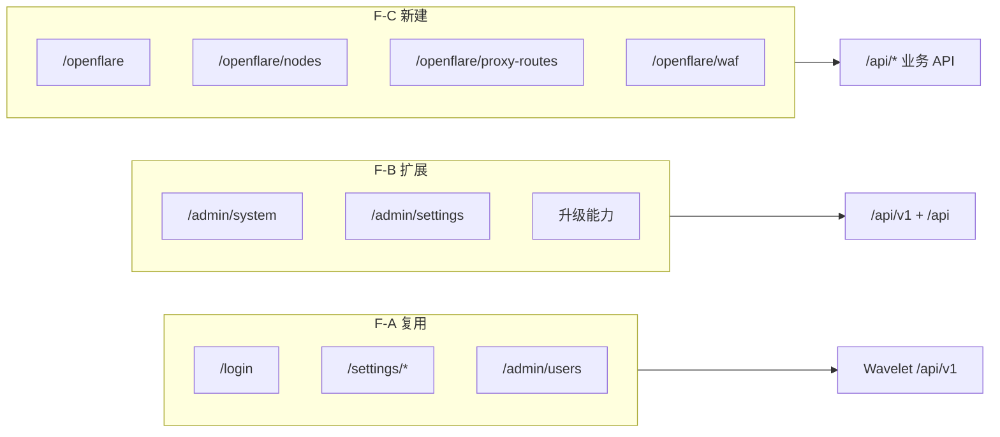
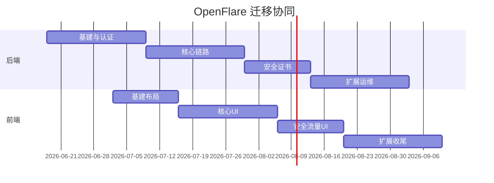

# OpenFlare → Wavelet 前端迁移计划

> **文档类型**：实现计划（Implementation Plan）  
> **创建日期**：2026-06-18  
> **状态**：实施中（阶段 0 基建 + 阶段 2 核心链路并行）
> **前置阅读**：[`Wavelet/AGENTS.md`](../../Wavelet/AGENTS.md)、[`docs/plan/20260618-openflare-wavelet-backend-migration.md`](./20260618-openflare-wavelet-backend-migration.md)  
> **依赖**：后端阶段一（旧路径 `/api/*` 兼容）完成后启动；阶段二可与后端阶段五并行

---

## 1. 目标与背景

### 1.1 需求背景

OpenFlare 管理控制台当前位于 `openflare-server/web/`（Next.js 15 + 静态导出嵌入 Go）。Wavelet 提供现代化全栈前端脚手架 `Wavelet/frontend/`（Next.js 16 + shadcn/ui + 完整 Admin 基建）。

迁移目标：

1. 将 OpenFlare **全部业务 UI** 按 Wavelet 设计风格重写，统一视觉与交互。
2. **复用 Wavelet 内置页面与组件**（布局、认证、设置、用户管理、Admin 基建），不重写平台能力。
3. 重叠职能（登录、用户、OAuth、Access Token、系统设置）**直接对接 Wavelet `/api/v1/*` API**，不再使用 `OpenFlare-Token`。
4. OpenFlare 业务 API 阶段一切至 `/api/*`（后端兼容层）；阶段二逐步规范化。

### 1.2 开发范围

| 范围内 | 范围外 |
|---|---|
| `openflare-server/web` 全部页面/功能迁移 | 文档站 `docs/` VitePress 改造 |
| Wavelet 布局/导航扩展 | Wavelet 框架核心页面逻辑修改 |
| OpenFlare 业务 Service 层新建 | 旧前端继续长期并存（迁移完成后废弃） |
| 静态导出 / embed 部署方案确认 | Agent/Relay/Flared 节点侧 UI |
| E2E 测试迁移 | 英文界面 |

### 1.3 迁移总原则

| 原则 | 说明 |
|---|---|
| **框架组件优先** | 使用 `Wavelet/frontend/components/ui/*`，禁止复制旧 `components/ui` 11 个自建组件 |
| **服务层规范** | 所有 API 调用经 `lib/services/`，继承 `BaseService` |
| **页面规范** | 遵循 AGENTS.md：`h1 text-2xl font-semibold tracking-tight`，单文件 ≤600 行 |
| **重叠不重写** | 登录/注册/用户管理/认证源/AccessToken 用 Wavelet 现成页面 |
| **业务新建** | OpenFlare 独有功能在 `app/(main)/openflare/` 新建 |
| **参考标杆** | 复杂页面参考 `/admin/database` 拆分模式、`/admin/demo` 组件用法 |

---

## 2. 现状与目标对照

### 2.1 技术栈对照

| 维度 | 旧前端 `openflare-server/web` | 目标 `Wavelet/frontend` |
|---|---|---|
| Next.js | 15 App Router | 16 App Router |
| React | 19 | 19 |
| CSS | Tailwind 4 | Tailwind 4 |
| UI 库 | 自建 11 组件 + HeroUI 混合 | shadcn/Radix 40+ |
| 图表 | ECharts | Recharts（必要时保留 ECharts） |
| 数据请求 | 原生 fetch | Axios + BaseService |
| 状态 | Context + Zustand + React Query | UserContext + React Query |
| 认证 | `OpenFlare-Token` localStorage | Session Cookie + AccessToken |
| API 路径 | `/api/*` | `/api/v1/*` + `/api/*`（业务） |
| 构建 | `output: 'export'` 嵌入 Go | `build:embed` 或 standalone |
| 路由详情 | `?id=` 查询参数 | 优先查询参数（保持静态兼容） |

### 2.2 目录结构对照

**旧前端（迁移源）**：

```
openflare-server/web/
├── app/(dashboard)/     # 18 个控制台路由
├── app/(public)/        # 7 个公开路由
├── features/            # 15 个业务模块（核心逻辑）
├── components/          # 布局 + 轻量 UI
└── lib/api/             # fetch 客户端
```

**目标前端（迁移目标）**：

```
Wavelet/frontend/
├── app/(auth)/                    # ✅ 复用：login, register
├── app/(main)/
│   ├── home/                      # 改造为 OpenFlare 仪表盘或重定向
│   ├── settings/                  # ✅ 复用 + 扩展 OpenFlare 个人设置
│   ├── admin/                     # ✅ 复用平台 Admin
│   └── openflare/                 # 🆕 OpenFlare 业务路由根
│       ├── page.tsx               # 仪表盘 /
│       ├── nodes/                 # 节点
│       ├── proxy-routes/          # 代理规则
│       ├── pages/                 # Pages 托管
│       ├── websites/              # 网站/证书
│       ├── waf/                   # WAF
│       ├── origins/               # 源站
│       ├── config-versions/       # 配置发布
│       ├── access-logs/           # 访问日志
│       ├── performance/           # 性能调优
│       ├── apply-logs/            # 应用日志
│       └── components/            # 跨页面 OpenFlare 子组件
├── components/                    # ✅ 复用框架组件
├── lib/services/
│   ├── index.ts                   # 注册 openflare 服务
│   └── openflare/                 # 🆕 业务 API 服务
│       ├── types.ts
│       ├── proxy-route.service.ts
│       ├── node.service.ts
│       └── ...
└── lib/navigation/                # 🆕 侧栏导航配置
```

---

## 3. 功能板块迁移总览

### 3.1 三类处理方式

| 类别 | 数量 | 策略 |
|---|---|---|
| **F-A 直接复用 Wavelet** | 10 板块 | 不改页面，仅改导航/文案/配置 |
| **F-B 扩展 Wavelet 页面** | 5 板块 | 在现有页面增加 OpenFlare 配置块 |
| **F-C 新建 OpenFlare 页面** | 12 板块 | 按 Wavelet 风格完整重写 |



---

## 4. F-A：直接复用 Wavelet（禁止重写）

| # | 旧路径/模块 | Wavelet 目标 | 迁移动作 | API 切换 |
|---|---|---|---|---|
| FA-1 | `/login` | `app/(auth)/login` | 删除旧登录页；导航指向 Wavelet | `/api/v1/user/login` |
| FA-2 | `/reset`, `/user/reset` | `app/(auth)/` 密码重置流 | 复用 Wavelet 重置流程 | `/api/v1/user/*` |
| FA-3 | 注册（若开放） | `app/(auth)/register` | 复用 | `/api/v1/user/register` |
| FA-4 | Cap PoW | `components/auth/cap-widget.tsx` | 直接引用 | `/api/cap/*` 或 `/api/v1/cap/*` |
| FA-5 | OAuth 回调 | `app/(auth)/` + OAuth 组件 | 回调 URL 改 Wavelet 格式 | `/api/v1/oauth/*` |
| FA-6 | `/user` 用户管理 | `app/(main)/admin/users` | **修复**：纳入侧栏导航 | `/api/v1/admin/users` |
| FA-7 | Access Token | `app/(main)/settings/access-token` | 复用 | `/api/v1/user/access-tokens` |
| FA-8 | 个人资料 | `app/(main)/settings/profile` | 复用 | `/api/v1/user/self` + `profile` |
| FA-9 | 修改密码 | `app/(main)/settings/security` | 复用 | `/api/v1/user/change-password` |
| FA-10 | 外观主题 | `app/(main)/settings/appearance` | 复用 Wavelet 40+ 主题 | 本地 |

**需删除的旧代码**：

```
openflare-server/web/features/auth/          # 整体废弃（保留类型参考）
openflare-server/web/app/(public)/login/
openflare-server/web/app/(public)/reset/
openflare-server/web/app/(dashboard)/user/   # 改用 /admin/users
openflare-server/web/lib/api/auth-token.ts   # 改用 Session
```

---

## 5. F-B：扩展 Wavelet 现有页面

| # | 旧功能 | 旧位置 | Wavelet 扩展位置 | 扩展内容 |
|---|---|---|---|---|
| FB-1 | 运维设置 | `/setting` 运维 Tab | `app/(main)/admin/settings` 或 `admin/system` | Agent 心跳阈值、GeoIP Provider、OpenResty 默认参数 |
| FB-2 | 系统设置 | `/setting` 系统 Tab | `admin/system` + `new-setting` skill | 登录开关、SMTP（若未覆盖）、公告 |
| FB-3 | 认证源 CRUD | `/setting` 系统 Tab | `admin/` 已有 `auth-source` 组件 | 确认 API 对齐；移除旧 modal |
| FB-4 | 数据库清理 | `/setting` 数据库 Tab | `admin/database` 或 `admin/settings` | 观测数据保留天数、手动清理按钮 |
| FB-5 | 服务升级 | 顶栏 `version-upgrade-modal` | 复用 `admin/updater` 能力 | 增加 OpenFlare 发版渠道 stable/preview |

**实现路径**：

| 文件 | 职责 |
|---|---|
| `app/(main)/admin/settings/components/openflare-ops.tsx` | 运维参数表单 |
| `app/(main)/admin/system/` 新增 KV | OpenFlare Option 映射为 SystemConfig（可选） |
| `lib/services/openflare/option.service.ts` | 读写 `/api/option/*` |
| `components/layout/app-sidebar.tsx` | 增加 OpenFlare 设置入口 |

---

## 6. F-C：新建 OpenFlare 业务页面（完整重写）

### 6.1 页面路由映射表

| # | 旧路由 | 新路由 | 页面文件 | 优先级 | 复杂度 |
|---|---|---|---|---|---|
| FC-1 | `/` | `/openflare` 或 `/home` 改造 | `app/(main)/openflare/page.tsx` | P0 | 高 |
| FC-2 | `/node` | `/openflare/nodes` | `openflare/nodes/page.tsx` | P0 | 很高 |
| FC-3 | `/node/detail?id=` | `/openflare/nodes/detail` | `openflare/nodes/detail/page.tsx` | P0 | 很高 |
| FC-4 | `/proxy-route` | `/openflare/proxy-routes` | `openflare/proxy-routes/page.tsx` | P0 | 很高 |
| FC-5 | `/proxy-route/detail?id=&section=` | `/openflare/proxy-routes/detail` | `openflare/proxy-routes/detail/page.tsx` | P0 | 极高 |
| FC-6 | `/config-version` | `/openflare/config-versions` | `openflare/config-versions/page.tsx` | P0 | 高 |
| FC-7 | `/waf` | `/openflare/waf` | `openflare/waf/page.tsx` | P1 | 很高 |
| FC-8 | `/waf/ip-groups` | `/openflare/waf/ip-groups` | `openflare/waf/ip-groups/page.tsx` | P1 | 高 |
| FC-9 | `/website` | `/openflare/websites` | `openflare/websites/page.tsx` | P1 | 高 |
| FC-10 | `/website/detail?id=` | `/openflare/websites/detail` | `openflare/websites/detail/page.tsx` | P1 | 高 |
| FC-11 | `/website/certificate` | `/openflare/websites/certificates` | `openflare/websites/certificates/page.tsx` | P1 | 很高 |
| FC-12 | `/website/dns-account` | `/openflare/websites/dns-accounts` | `openflare/websites/dns-accounts/page.tsx` | P1 | 中 |
| FC-13 | `/pages` | `/openflare/pages` | `openflare/pages/page.tsx` | P2 | 中 |
| FC-14 | `/pages/detail?id=` | `/openflare/pages/detail` | `openflare/pages/detail/page.tsx` | P2 | 中 |
| FC-15 | `/origin` | `/openflare/origins` | `openflare/origins/page.tsx` | P2 | 低 |
| FC-16 | `/origin/detail?id=` | `/openflare/origins/detail` | `openflare/origins/detail/page.tsx` | P2 | 低 |
| FC-17 | `/access-log` | `/openflare/access-logs` | `openflare/access-logs/page.tsx` | P2 | 高 |
| FC-18 | `/apply-log?node_id=` | `/openflare/apply-logs` | `openflare/apply-logs/page.tsx` | P2 | 低 |
| FC-19 | `/performance` | `/openflare/performance` | `openflare/performance/page.tsx` | P2 | 中 |
| FC-20 | `/about` | `/docs` 或 `/openflare/about` | 复用 docs 或新建 | P3 | 低 |

### 6.2 各板块详细迁移说明

#### FC-1 总览仪表盘

| 项 | 旧实现 | 新实现 |
|---|---|---|
| 源文件 | `features/dashboard/components/dashboard-page.tsx` | `openflare/page.tsx` + `components/dashboard-overview.tsx` |
| 服务 | `features/dashboard/api.ts` | `lib/services/openflare/dashboard.service.ts` |
| API | `GET /api/dashboard/overview` | 同左（阶段一） |
| 图表 | ECharts `TrendChart`, `RankChart` | Recharts 或保留 ECharts（世界地图建议保留 ECharts/geoJSON） |
| 组件 | `world-stage` 世界地图 | `openflare/components/world-map.tsx` |
| 关键指标 | 流量/容量/节点健康/24h 趋势 | 完整保留 |

**子组件拆分**：

```
openflare/components/dashboard/
├── overview-stats.tsx        # 顶部指标卡片（Stat Card 模式）
├── traffic-trend-chart.tsx   # 流量趋势
├── capacity-trend-chart.tsx  # 容量趋势
├── node-health-table.tsx     # 节点健康列表
├── geo-distribution.tsx      # 国家分布
└── world-map.tsx             # 世界地图
```

#### FC-2/FC-3 节点管理

| 项 | 说明 |
|---|---|
| 源文件 | `features/nodes/components/nodes-page.tsx`（列表）、`node-detail-page.tsx`（1800+ 行）、`relay-detail-page.tsx`、`tunnel-detail-page.tsx` |
| 新结构 | 列表页 ≤400 行；详情按 `node_type` 拆三个子组件 |
| API 服务 | `node.service.ts` |
| 关键功能 | 三类型筛选、Bootstrap Token、Agent 升级、强制同步、OpenResty 重启、安装命令、5s 轮询 |
| 对话框 | 使用 `Sheet`/`Dialog` 替代旧 `app-modal` |

**详情页拆分**：

```
openflare/nodes/detail/
├── page.tsx
└── components/
    ├── edge-node-detail.tsx    # edge_node
    ├── relay-node-detail.tsx   # tunnel_relay
    ├── tunnel-node-detail.tsx  # tunnel_client
    ├── node-observability.tsx  # 可观测性 Tab
    ├── node-actions.tsx        # 操作按钮组
    └── install-command.tsx     # 安装命令生成
```

**API 映射**：

| 功能 | API |
|---|---|
| 列表 | `GET /api/nodes/` |
| 创建/更新/删除 | `POST /api/nodes/` 等 |
| Bootstrap | `GET/POST /api/nodes/bootstrap-token/*` |
| Agent 升级 | `POST /api/nodes/:id/agent-update` |
| 可观测 | `GET /api/nodes/:id/observability` |
| 应用日志 | `GET /api/apply-logs/?node_id=` |

#### FC-4/FC-5 代理规则

| 项 | 说明 |
|---|---|
| 源文件 | `proxy-routes-page.tsx`、`proxy-route-config-page.tsx`（1400+ 行） |
| 新结构 | 列表 + 详情 6 Section Tab |
| Section | `domains`、`limits`、`proxy`、`cache`、`waf`、`auth` |

**详情 Tab 组件**：

```
openflare/proxy-routes/detail/components/
├── domain-section.tsx
├── limits-section.tsx
├── proxy-section.tsx
├── cache-section.tsx
├── waf-section.tsx
├── auth-section.tsx
├── publish-diff-drawer.tsx   # 发布前 diff
└── route-header.tsx
```

**API 映射**：

| 功能 | API |
|---|---|
| CRUD | `/api/proxy-routes/*` |
| 关联数据 | `/api/managed-domains/`、`/api/pages/`、`/api/nodes/`、`/api/tls-certificates/` |
| WAF 绑定 | `/api/waf/sites/:routeId/rule-groups` |
| 发布 | `GET /api/config-versions/diff`、`POST /api/config-versions/publish` |

#### FC-6 配置发布

| 项 | 说明 |
|---|---|
| 源文件 | `features/config-versions/components/config-versions-page.tsx` |
| 功能 | 版本列表、快照查看、预览、diff、发布、激活、清理 |
| UI 模式 | `Table` + `Sheet` 预览 + `Dialog` 确认发布 |

#### FC-7/FC-8 WAF

| 项 | 说明 |
|---|---|
| 源文件 | `waf-page.tsx`（规则组）、`ip-groups-page.tsx` |
| 新路由 | `/openflare/waf` + `/openflare/waf/ip-groups` |
| 复杂 UI | 规则条目 Modal、PoW Tab、站点批量绑定 Drawer |
| 参考 | `/admin/demo` 的 Form/Table 模式 |

**子组件**：

```
openflare/waf/components/
├── rule-group-table.tsx
├── rule-group-form.tsx
├── rule-entry-dialog.tsx
├── rule-list-section.tsx
├── pow-config-panel.tsx
├── site-apply-sheet.tsx
├── ip-group-table.tsx
├── ip-group-form.tsx
└── ip-group-sync-button.tsx
```

#### FC-9~FC-12 网站与证书

| 页面 | 源文件 | 关键 Modal |
|---|---|---|
| 托管域名列表 | `websites-page.tsx` | 创建/编辑 Dialog |
| 域名详情 | `website-detail-page.tsx` | 证书关联、WAF 绑定 |
| 证书管理 | `certificate-page.tsx` | ACME 申请、续期、导入、转换 |
| DNS 账号 | `dns-account-page.tsx` | 多厂商表单 |

**API**：`/api/managed-domains/*`、`/api/tls-certificates/*`、`/api/dns-accounts/*`、`/api/acme-accounts/default`

#### FC-13/FC-14 Pages 静态托管

| 功能 | 说明 |
|---|---|
| 项目 CRUD | Table + Dialog |
| 部署上传 | 使用 Wavelet 上传组件 + XHR 进度 |
| 部署管理 | 版本列表、激活、删除 |
| API | `/api/pages/*` |

#### FC-15/FC-16 源站

| 功能 | 说明 |
|---|---|
| 简单 CRUD | 列表 + 详情，低复杂度 |
| API | `/api/origins/*` |

#### FC-17 访问日志

| Tab | API |
|---|---|
| 明细 | `GET /api/access-logs/` |
| 时间折叠 | `GET /api/access-logs/folds` |
| IP 汇总 | `GET /api/access-logs/ip-summary` |
| IP 趋势 | `GET /api/access-logs/ip-summary/trend` |
| 清理 | `POST /api/access-logs/cleanup` |

**UI**：`DataTable` + 筛选器 + 趋势图（Recharts）

#### FC-18 应用日志

| 功能 | 说明 |
|---|---|
| 按节点筛选 | `?node_id=` 查询参数 |
| 入口 | 节点详情页跳转 |
| API | `GET /api/apply-logs/` |

#### FC-19 性能调优

| 功能 | 说明 |
|---|---|
| 源文件 | `features/performance/` + `settings-page` 运维重叠部分 |
| 内容 | OpenResty 全局参数表单 |
| 预览 | `GET /api/config-versions/preview` |
| API | `GET/POST /api/option/*` |

---

## 7. Service 层迁移清单

### 7.1 新建服务文件

| 服务文件 | basePath | 对应旧 `features/*/api.ts` |
|---|---|---|
| `dashboard.service.ts` | `/api/dashboard` | `features/dashboard/api.ts` |
| `node.service.ts` | `/api/nodes` | `features/nodes/api.ts` |
| `proxy-route.service.ts` | `/api/proxy-routes` | `features/proxy-routes/api.ts` |
| `config-version.service.ts` | `/api/config-versions` | `features/config-versions/api.ts` |
| `waf.service.ts` | `/api/waf` | `features/waf/api.ts` |
| `website.service.ts` | `/api/managed-domains` | `features/websites/api.ts` |
| `tls-certificate.service.ts` | `/api/tls-certificates` | `features/tls-certificates/api.ts` |
| `dns-account.service.ts` | `/api/dns-accounts` | `features/dns-accounts/api.ts` |
| `acme-account.service.ts` | `/api/acme-accounts` | `features/acme-accounts/api.ts` |
| `pages.service.ts` | `/api/pages` | `features/pages/api.ts` |
| `origin.service.ts` | `/api/origins` | `features/origins/api.ts` |
| `access-log.service.ts` | `/api/access-logs` | `features/access-logs/api.ts` |
| `apply-log.service.ts` | `/api/apply-logs` | `features/apply-logs/api.ts` |
| `option.service.ts` | `/api/option` | `features/settings/api.ts` |
| `update.service.ts` | `/api/update` | `features/update/api.ts` |
| `types.ts` | — | 汇总 TypeScript 类型 |

### 7.2 服务注册

```typescript
// lib/services/index.ts 新增
import { openflareDashboardService } from './openflare/dashboard.service';
// ...

const services = {
  // ... 现有 Wavelet 服务
  openflareDashboard: openflareDashboardService,
  openflareNode: openflareNodeService,
  // ...
};
```

### 7.3 API 客户端适配

| 阶段 | 认证方式 | Base URL |
|---|---|---|
| 阶段一（过渡期） | Session Cookie（Wavelet 登录）+ 业务 API 同域 | `/api` |
| 阶段二（稳定） | Session + 可选 AccessToken | `/api` + `/api/v1` |

**注意**：移除 `OpenFlare-Token` localStorage 逻辑；统一使用 Wavelet `proxy.ts` 鉴权。

---

## 8. 组件复用与替换对照

### 8.1 旧 → Wavelet 组件映射

| 旧组件 | Wavelet 替代 |
|---|---|
| `app-card` | `Card` |
| `app-modal` | `Dialog` |
| `drawer` | `Sheet` |
| `input` | `Input` |
| `textarea` | `Textarea` |
| `switch` | `Switch` |
| `status-badge` | `Badge` |
| `theme-toggle` | 内置 ThemeProvider |
| `sonner` | `sonner`（已有） |
| `empty-state` | `components/common/empty.tsx` |
| `loading-state` | `Skeleton` + `loading.tsx` |
| `error-state` | `error.tsx` |
| `resource-primitives` | `Form` + `Field` + shadcn 表单模式 |
| `trend-chart` / `rank-chart` | Recharts 或 ECharts 封装 |

### 8.2 布局改造

| 项 | 旧实现 | 新实现 |
|---|---|---|
| 侧栏 | `dashboard-sidebar.tsx` | `components/layout/app-sidebar.tsx` 扩展 |
| 顶栏 | `dashboard-topbar.tsx` | `components/layout/header.tsx` 扩展 |
| 导航配置 | `lib/constants/navigation.ts` | `lib/navigation/openflare-nav.ts` |
| 鉴权守卫 | `DashboardAuthGuard` | Wavelet `proxy.ts` + `use-auth-redirect` |

**新侧栏导航结构**：

```
OpenFlare
├── 总览          /openflare
├── 节点          /openflare/nodes
├── 代理规则      /openflare/proxy-routes
├── 配置发布      /openflare/config-versions
├── WAF           /openflare/waf
├── 网站          /openflare/websites
├── Pages         /openflare/pages
├── 源站          /openflare/origins
├── 访问日志      /openflare/access-logs
├── 性能调优      /openflare/performance
---
平台（Wavelet 原生）
├── 用户管理      /admin/users
├── 系统设置      /admin/settings
├── 任务调度      /admin/tasks
├── 日志分析      /admin/logs
├── ...
```

---

## 9. 分阶段实施计划

### 阶段 0：基建（1 周）— ✅ 已完成

| 任务 ID | 任务 | 状态 |
|---|---|---|
| F0-1 | 创建 `lib/services/openflare/` 骨架 | ✅ `legacy-base.service.ts` + types |
| F0-2 | 创建 `lib/navigation/openflare-nav.ts` | ✅ |
| F0-3 | 扩展 `app-sidebar.tsx` | ✅ OpenFlare 导航组 |
| F0-4 | 确认 embed 构建方案 | ⏳ |
| F0-5 | 移除旧前端入口引用准备 | ⏳ |

### 阶段 1：认证与布局（1 周）

| 任务 ID | 任务 |
|---|---|
| F1-1 | 确认 Wavelet 登录/register 可用 |
| F1-2 | OAuth 回调路径配置 |
| F1-3 | 侧栏 + 顶栏 OpenFlare 品牌 |
| F1-4 | `/home` 重定向至 `/openflare` |
| F1-5 | 用户管理入口暴露至 `/admin/users` |

**验收**：Wavelet 登录后可看到 OpenFlare 空导航骨架。

### 阶段 2：核心链路 UI（2–3 周）— 进行中

| 任务 ID | 页面 | 状态 |
|---|---|---|
| F2-1 | 节点列表 + 详情（edge） | ✅ 列表 + Edge 详情 |
| F2-2 | 代理规则列表 + 详情 | ✅ 列表 + 6 Tab 骨架 |
| F2-3 | 配置发布 | ✅ |
| F2-4 | 应用日志 | ✅ |
| F2-5 | relay/tunnel 详情页 | ⏳ |
| F2-6 | 代理规则详情各 Section 表单实装 | ⏳ |

**验收**：UI 完成节点→规则→发布闭环操作。

### 阶段 3：安全与流量（2 周）

| 任务 ID | 页面 |
|---|---|
| F3-1 | WAF 规则组 |
| F3-2 | WAF IP 组 |
| F3-3 | 网站/域名 |
| F3-4 | TLS 证书 + ACME |
| F3-5 | DNS 账号 |

### 阶段 4：扩展（2 周）

| 任务 ID | 页面 |
|---|---|
| F4-1 | Pages 托管 |
| F4-2 | 源站 |
| F4-3 | 访问日志 |
| F4-4 | 总览仪表盘 |
| F4-5 | 性能调优 |

### 阶段 5：设置合并与收尾（1–2 周）

| 任务 ID | 任务 |
|---|---|
| F5-1 | OpenFlare 运维/系统设置并入 Admin |
| F5-2 | 服务升级 UI 对接 `admin/updater` |
| F5-3 | 废弃 `openflare-server/web` 引用 |
| F5-4 | Playwright E2E 核心路径 |
| F5-5 | 视觉走查与响应式适配 |
| F5-6 | Handover 文档 |

---

## 10. 旧前端源文件 → 新文件完整映射

| 旧文件 | 新文件 | 动作 |
|---|---|---|
| `features/dashboard/components/dashboard-page.tsx` | `openflare/page.tsx` | 重写 |
| `features/nodes/components/nodes-page.tsx` | `openflare/nodes/page.tsx` | 重写 |
| `features/nodes/components/node-detail-page.tsx` | `openflare/nodes/detail/components/edge-node-detail.tsx` | 拆分重写 |
| `features/nodes/components/relay-detail-page.tsx` | `openflare/nodes/detail/components/relay-node-detail.tsx` | 拆分重写 |
| `features/nodes/components/tunnel-detail-page.tsx` | `openflare/nodes/detail/components/tunnel-node-detail.tsx` | 拆分重写 |
| `features/nodes/components/node-editor-modal.tsx` | `openflare/nodes/components/node-form-dialog.tsx` | 重写 |
| `features/proxy-routes/components/proxy-routes-page.tsx` | `openflare/proxy-routes/page.tsx` | 重写 |
| `features/proxy-routes/components/proxy-route-config-page.tsx` | `openflare/proxy-routes/detail/page.tsx` + 6 section | 拆分重写 |
| `features/proxy-routes/components/proxy-route-create-drawer.tsx` | `openflare/proxy-routes/components/create-sheet.tsx` | 重写 |
| `features/config-versions/components/config-versions-page.tsx` | `openflare/config-versions/page.tsx` | 重写 |
| `features/waf/components/waf-page.tsx` | `openflare/waf/page.tsx` | 重写 |
| `features/waf/components/ip-groups-page.tsx` | `openflare/waf/ip-groups/page.tsx` | 重写 |
| `features/waf/components/rule-entry-modal.tsx` | `openflare/waf/components/rule-entry-dialog.tsx` | 重写 |
| `features/websites/components/websites-page.tsx` | `openflare/websites/page.tsx` | 重写 |
| `features/websites/components/website-detail-page.tsx` | `openflare/websites/detail/page.tsx` | 重写 |
| `features/tls-certificates/components/*.tsx` | `openflare/websites/certificates/components/*.tsx` | 重写 |
| `features/pages/components/pages-page.tsx` | `openflare/pages/page.tsx` | 重写 |
| `features/pages/components/pages-detail-page.tsx` | `openflare/pages/detail/page.tsx` | 重写 |
| `features/origins/components/origins-page.tsx` | `openflare/origins/page.tsx` | 重写 |
| `features/access-logs/components/access-logs-page.tsx` | `openflare/access-logs/page.tsx` | 重写 |
| `features/apply-logs/components/apply-logs-page.tsx` | `openflare/apply-logs/page.tsx` | 重写 |
| `features/performance/components/performance-page.tsx` | `openflare/performance/page.tsx` | 重写 |
| `features/settings/components/settings-page.tsx` | 拆入 `admin/settings` + `settings/*` | 拆分废弃 |
| `features/update/components/version-upgrade-modal.tsx` | 并入 `header` + `admin/updater` | 适配 |
| `features/auth/components/*.tsx` | — | **删除**，用 Wavelet |
| `features/users/components/*.tsx` | — | **删除**，用 `/admin/users` |
| `components/layout/dashboard-shell.tsx` | `components/layout/` Wavelet 布局 | 废弃 |
| `components/ui/*.tsx` | `components/ui/*.tsx` Wavelet | 废弃 |
| `lib/api/client.ts` | `lib/services/core/base.service.ts` | 废弃 |
| `store/app-shell.ts` | Wavelet 侧栏内置状态 | 废弃 |

---

## 11. 页面-API 完整依赖表（迁移后）

> 认证类 API 在阶段二切换至 `/api/v1/*`；业务 API 保持 `/api/*`。

| 新页面 | 依赖 API 端点 |
|---|---|
| `/openflare` | `GET /api/dashboard/overview` |
| `/openflare/nodes` | `GET/POST /api/nodes/`, `GET /api/nodes/bootstrap-token` |
| `/openflare/nodes/detail` | `GET/POST /api/nodes/:id/*`, `GET /api/nodes/:id/observability`, `GET /api/nodes/:id/agent-release` |
| `/openflare/proxy-routes` | `GET/POST /api/proxy-routes/*` |
| `/openflare/proxy-routes/detail` | 同上 + `GET /api/managed-domains/`, `GET /api/pages/`, `GET /api/tls-certificates/`, `GET/POST /api/waf/sites/:id/rule-groups`, `GET /api/config-versions/diff`, `POST /api/config-versions/publish` |
| `/openflare/config-versions` | `GET/POST /api/config-versions/*` |
| `/openflare/waf` | `GET/POST /api/waf/rule-groups/*`, `GET /api/proxy-routes/` |
| `/openflare/waf/ip-groups` | `GET/POST /api/waf/ip-groups/*` |
| `/openflare/websites` | `GET/POST /api/managed-domains/*` |
| `/openflare/websites/detail` | 同上 + `GET /api/proxy-routes/`, WAF 绑定 API |
| `/openflare/websites/certificates` | `GET/POST /api/tls-certificates/*`, `GET /api/acme-accounts/default` |
| `/openflare/websites/dns-accounts` | `GET/POST /api/dns-accounts/*` |
| `/openflare/pages` | `GET/POST /api/pages/*` |
| `/openflare/pages/detail` | 部署相关 `/api/pages/:id/deployments/*` |
| `/openflare/origins` | `GET/POST /api/origins/*` |
| `/openflare/access-logs` | `GET/POST /api/access-logs/*` |
| `/openflare/apply-logs` | `GET/POST /api/apply-logs/*` |
| `/openflare/performance` | `GET/POST /api/option/*`, `GET /api/config-versions/preview` |
| `/login` | `POST /api/v1/user/login`, Cap API |
| `/admin/users` | `/api/v1/admin/users/*` |
| `/settings/*` | `/api/v1/user/*` |
| `/admin/settings` | `/api/v1/admin/*` + `/api/option/*`（OpenFlare 扩展） |
| 顶栏升级 | `/api/update/*` 或 `/api/v1/admin/updater/*` |

---

## 12. 验证计划

### 12.1 开发验证

```bash
cd Wavelet/frontend
pnpm lint
pnpm build
pnpm dev   # 联调 Wavelet api 进程
```

### 12.2 功能走查清单

| 场景 | 步骤 | 预期 |
|---|---|---|
| 登录 | Wavelet 登录页 | Session 建立，跳转 /openflare |
| 创建节点 | nodes → 创建 → 复制安装命令 | 节点上线 |
| 创建规则 | proxy-routes → 6 section 配置 | 保存成功 |
| 发布配置 | config-versions → diff → publish → activate | Agent 收到配置 |
| WAF 拦截 | waf → 创建规则组 → 绑定站点 | 规则生效 |
| 证书申请 | certificates → ACME | 证书签发 |
| Pages 部署 | pages → 上传 zip → 激活 | 部署成功 |
| 访问日志 | access-logs → 筛选/折叠 | 数据展示 |
| 用户管理 | admin/users | CRUD 正常 |
| 升级 | 顶栏检查更新 | WS 日志 + 升级成功 |

### 12.3 E2E 测试规划

| 测试文件 | 覆盖路径 |
|---|---|
| `e2e/openflare-auth.spec.ts` | 登录/登出 |
| `e2e/openflare-node.spec.ts` | 节点 CRUD |
| `e2e/openflare-proxy-route.spec.ts` | 规则 + 发布 |
| `e2e/openflare-waf.spec.ts` | WAF 规则组 |

---

## 13. 风险与缓解

| 风险 | 缓解 |
|---|---|
| 大文件拆分工作量大 | 按 section/tab 并行；参考 admin/database |
| ECharts → Recharts 世界地图 | 保留 ECharts 作为可选依赖 |
| 静态导出 vs SSR | 优先确认 `build:embed`；保留 `?id=` 查询参数路由 |
| 设置页 2400 行拆分遗漏 | 逐项对照 5 Tab 功能清单 |
| `/user` 无入口历史问题 | 统一纳入 `/admin/users` 侧栏 |
| 微信/OAuth 特殊流程 | 与后端 legacy 层同步验证 |
| 上传进度 | Pages 部署保留 XHR 进度；复用 Wavelet upload 基建 |

---

## 14. 里程碑

| 里程碑 | 时间 | 标志 |
|---|---|---|
| M1 布局就绪 | 第 1 周 | 导航 + 登录 + 空页面 |
| M2 核心 UI | 第 4 周 | 节点/规则/发布可用 |
| M3 安全流量 | 第 6 周 | WAF/证书/网站 |
| M4 全页面 | 第 8 周 | 全部 FC 页面完成 |
| M5 上线切换 | 第 10 周 | 废弃旧 web，embed 新前端 |

---

## 15. 与后端计划协同时间表



| 后端里程碑 | 前端可启动项 |
|---|---|
| M2 认证联调 | F1 认证与布局 |
| M3 核心链路 | F2 节点/规则/发布 |
| M4 安全证书 | F3 WAF/网站/证书 |
| M5 全量功能 | F4 仪表盘/日志/Pages |

---

## 16. 参考文档

- [`Wavelet/AGENTS.md`](../../Wavelet/AGENTS.md) — **开发前必读**
- [`docs/plan/20260618-openflare-wavelet-backend-migration.md`](./20260618-openflare-wavelet-backend-migration.md)
- Wavelet 标杆页面：`Wavelet/frontend/app/(main)/admin/database/`、`admin/demo/`
- 旧前端源码：`openflare-server/web/features/`