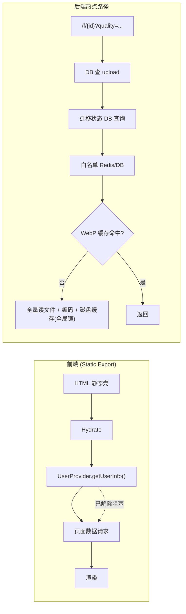
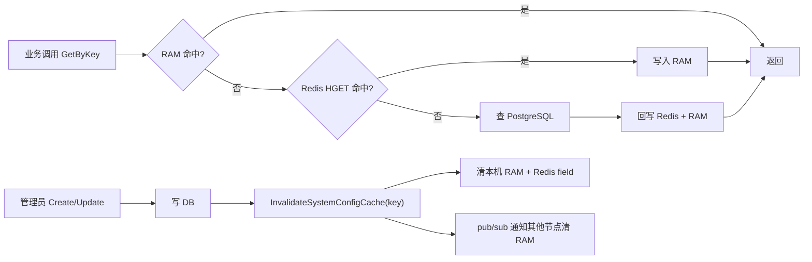

# Wavelet 系统性能分析与优化建议

> 分析日期：2026-06-17  
> 范围：Go 后端 + Next.js 前端  
> 目标：识别可能在生产环境真实出现的性能问题，并给出高 ROI 优化路线

**状态图例**：`✅ 已完成` · `🔶 部分完成` · `⬜ 待做`

| 修复批次 | 范围 | 状态 |
|----------|------|------|
| P0 后端 #1–#4 | WebP 锁、文件路径缓存、增量统计、复合索引 | ✅ |
| P0 前端 #6–#7 | 认证并行化、日志虚拟化 | ✅ |
| P1 #9 | 公共配置 Redis 列表缓存 | ✅ |
| P1 参数中心 | 系统配置 Otter RAM 缓存 + 统一失效 + 多节点 pub/sub | ✅ |
| P1 CAPTCHA | 运行时配置快照 + 批量加载 + pub/sub 失效 | ✅ |
| P0 前端 #12–#19 | dynamic 分割、React Query、登录并行、Tooltip、lazy、barrel 收窄 | ✅ |

---

## 目录

- [架构概览与核心瓶颈](#架构概览与核心瓶颈)
- [Critical — 高概率生产问题](#critical--高概率生产问题)
- [Medium — 中等风险](#medium--中等风险)
- [高价值优化路线图](#高价值优化路线图)
- [已做得好的设计](#已做得好的设计)
- [场景风险矩阵](#场景风险矩阵)
- [优先行动清单](#优先行动清单)

---

## 架构概览与核心瓶颈



**参数中心读路径**（`SystemConfig.GetByKey`）：



当前最大的结构性问题（2026-06-17 更新）：

1. **前端**：~~全局认证瀑布流~~ ✅ 已改为 layout 即时渲染 + 子页面 `RequireAuth` 自行处理未登录态；~~Admin 重模块无 `dynamic()` 分割~~ ✅ database/logs/settings 已懒加载子模块。其余路由 `page.tsx` 仍为 `"use client"`（静态导出下 RSC 收益有限，待逐步薄壳化）。
2. **后端**：文件服务路径（`/f/{id}`）仍是最高频热点；~~磁盘缓存全局互斥锁~~ ✅ 已改为 `RWMutex` + `singleflight`，但 WebP miss 仍在请求线程内同步编码，部署预热与异步回退原图尚未落地。
3. **参数中心**：~~`GetByKey` 每次直打 Redis~~ ✅ 已加 Otter v2 进程内缓存（`pkg/cache/ram`），读路径为 RAM → Redis → DB；管理员写配置后统一失效 RAM + Redis，并通过 pub/sub 同步多节点本地缓存。

---

## Critical — 高概率生产问题

### 1. 图片 WebP 服务：请求路径阻塞 + 全局锁串行化 `🔶 部分完成`

**涉及文件**：

- `internal/apps/upload/file_server.go`
- `pkg/cache/disk/cache.go`

**问题描述**：

缓存未命中时，在 HTTP 请求 goroutine 内执行：

1. `io.ReadAll` 将原始文件全量读入内存
2. 进程内 WebP 解码 + 编码
3. 写入磁盘缓存

同时，磁盘缓存 `Get`/`Set` 使用**全局 `sync.Mutex`**，所有并发图片请求在缓存层完全串行。

```go
// file_server.go — 缓存 miss 时的重操作
origBytes, err := getOriginalFileBytes(ctx, upload)  // io.ReadAll
webpBytes, err = CompressImageToWebP(bytes.NewReader(origBytes), quality)
cache.Set(cacheKey, webpBytes, diskcache.NoExpiration)

// pkg/cache/disk/cache.go — 全局互斥锁
func (c *Cache) Get(key string) ([]byte, error) {
    c.mu.Lock()
    defer c.mu.Unlock()
    // ...
}
```

**生产表现**：

- 首次访问或缓存淘汰后，P99 延迟从几十毫秒飙升到数秒
- 并发图片请求形成「隐形队列」
- 大文件全量读入带来内存尖峰，可能触发 OOM 或 GC 停顿

**优化价值**：⭐⭐⭐⭐⭐

**建议**：

- [x] ✅ 磁盘缓存改用 `RWMutex`，读路径不互斥 — `pkg/cache/disk/cache.go`
- [x] ✅ 对同一 cache key 使用 `singleflight` 合并并发 miss — `internal/apps/upload/file_server.go`
- [ ] 部署后强制执行 `upload:warm_image_cache` 异步预热任务
- [ ] 考虑 miss 时先返回原图，后台异步生成 WebP

---

### 2. 文件访问路径：每次请求多次 DB/Redis 查询 `✅ 已完成`

**涉及文件**：

- `internal/apps/upload/storage_ops.go`
- `internal/apps/upload/file_server.go`

**问题描述**：

存储迁移状态**无进程内缓存**，每次文件操作都查询 `w_task_executions`：

```go
// storage_ops.go
func StorageReadOnly(ctx context.Context) bool {
    execution, ok, err := latestStorageMigrationExecution(ctx)
    // ...
}

func backendForStoredDriver(ctx context.Context, driver storage.Driver) (storage.Backend, error) {
    // 可能再次调用 currentMigrationTargetConfig → 又一次相同 DB 查询
}
```

公开文件白名单每次走 Redis/DB：

```go
// file_server.go
func isFilePublic(ctx context.Context, uploadType string) bool {
    sc.GetByKey(ctx, model.ConfigKeyFileAccessWhitelist)
    // JSON 解析 + 遍历
}
```

对比：`storage.Active()` 已有 5 秒内存缓存 + Redis pub/sub 失效机制，迁移状态却未复用该模式。

**生产表现**：

- 每个 `/f/{id}` 请求额外 2–4 次 DB/Redis 往返
- 图片站/CDN 场景下 QPS 放大后 PostgreSQL 连接池压力明显

**优化价值**：⭐⭐⭐⭐⭐

**建议**：

- [x] ✅ 为 `StorageReadOnly` / `latestStorageMigrationExecution` 增加 5s TTL 进程内缓存 — `internal/apps/upload/access_cache.go`
- [x] ✅ 配置变更或迁移状态变化时通过 Redis pub/sub 失效 — `access_cache.go` + `system_config/routers.go`
- [x] ✅ `file_access_whitelist` 增加进程内缓存，复用 `GetByKey` 的失效机制 — `access_cache.go`

---

### 3. Admin 文件统计：无界全表扫描 `✅ 已完成`

**涉及文件**：`internal/apps/upload/stats.go`

**问题描述**：

```go
err = db.DB(ctx).Model(&model.Upload{}).
    Select("extension, mime_type, file_size").
    Where("status != ?", model.UploadStatusDeleted).
    Scan(&fileRaws).Error
// 然后在 Go 中遍历全量结果做分类统计
```

**生产表现**：

- 10 万+ 文件时，管理端「文件统计」接口耗时数秒
- 占用数百 MB 内存，可能拖垮 admin API

**优化价值**：⭐⭐⭐⭐

**建议**：

- [ ] 改为 SQL `GROUP BY` + `CASE WHEN` 聚合（未采用）
- [x] ✅ 维护增量统计表，上传/删除时更新计数 — `w_upload_stats` + `stats_counter.go` + `GetFileStats` 读统计表

---

### 4. `w_uploads` 索引缺口 `✅ 已完成`

**涉及文件**：`internal/db/migrator/goose/postgres/202606090001_initial_schema.sql`

**当前索引**：`user_id`, `file_path`, `hash`, `type`

**缺失的高频查询索引**：

| 查询场景 | 建议索引 |
|----------|----------|
| 清理任务 `status + created_at` | `(status, created_at)` |
| 存储迁移 `storage_driver + status` | `(storage_driver, status)` |
| 秒传去重 `hash + file_size + status` | `(hash, file_size, status)` |

**生产表现**：

- 数据量增长后，清理 worker、迁移任务、上传去重退化为顺序扫描
- 后台任务积压，admin 操作变慢

**优化价值**：⭐⭐⭐⭐

**建议**：

- [x] ✅ 通过 goose migration 新增上述复合索引（PostgreSQL + SQLite 双方言）— `202606170001_add_upload_composite_indexes.sql`

---

### 5. 批量 ZIP 下载：无上限 + 同步阻塞

**涉及文件**：`internal/apps/upload/routers.go` — `BatchDownloadFiles`

**问题描述**：

- `req.IDs` 无数量上限
- 在请求 goroutine 内串行打开每个文件并 `io.Copy` 到 ZIP
- 远端 S3 场景下单个文件就可能耗时数秒

**生产表现**：

- 网关超时、连接耗尽
- Admin 批量下载操作卡死

**优化价值**：⭐⭐⭐⭐

**建议**：

- [ ] 限制单次批量数量（如 max 50）
- [ ] 或改为 Asynq 后台任务生成 ZIP，前端轮询下载链接

---

### 6. 前端全局认证瀑布流 `✅ 已完成`

**涉及文件**：

- `frontend/contexts/user-context.tsx`
- `frontend/app/(main)/layout.tsx`

**问题描述**：

```tsx
// user-context.tsx — 挂载时获取用户
useEffect(() => {
  fetchUser()
}, [fetchUser])

// layout.tsx — 阻塞所有子页面渲染
if (loading || !user) {
  return <LoadingPage text="登录状态" badgeText="Auth" />
}
```

**生产表现**：

- 每次进入 `/home`、`/files`、`/admin/*` 都先等 `getUserInfo`（约 200–800ms）
- 页面级数据请求无法并行启动，TTI 被硬性拉长

**优化价值**：⭐⭐⭐⭐⭐

**建议**：

- [x] ✅ Layout 不阻塞渲染，子页面自行处理未登录状态 — `layout.tsx` + `RequireAuth` / `RequireAdminAuth`
- [ ] 或 Server Component 通过 cookie 预取 session，消除客户端首屏等待
- [x] ✅ `/login`、`/register` 跳过 `getUserInfo` — `user-context.tsx`

---

### 7. 实时日志面板：2000 行 DOM 无虚拟化 `✅ 已完成`

**涉及文件**：`frontend/components/common/admin/app-logs.tsx`

**问题描述**：

- 日志上限 2000 行（内存有界，但 DOM 无界）
- 每行渲染完整 `<div>`，无虚拟滚动
- `@tanstack/react-virtual` 已在 `package.json` 但未使用

**生产表现**：

- 管理员开着日志 Tab 时 CPU/内存持续升高
- 滚动卡顿，长时间运行拖慢整台机器

**优化价值**：⭐⭐⭐⭐

**建议**：

- [x] ✅ 使用 `useVirtualizer` 只渲染可视区域行 — `app-logs.tsx`
- [x] ✅ 行组件 `React.memo` 避免无效重渲染 — `LogLine`

---

## Medium — 中等风险

| # | 问题 | 位置 | 影响 |
|---|------|------|------|
| 1 | ~~公共配置接口无 Redis 缓存~~ ✅ | `internal/model/system_configs.go` — `ListVisibleSystemConfigs` | ~~每次前端启动/登录直查 PostgreSQL~~ → Redis 列表缓存 + Create/Update 时失效 |
| 2 | ~~CAPTCHA 每次 5 次独立 `GetByKey`~~ ✅ | `internal/apps/cap/runtime_settings.go` | ~~登录高峰 5× 配置读取~~ → `CurrentSettings` 快照一次加载 6 个 key，`Generate`/`Redeem`/中间件零 `GetByKey` |
| 3 | ~~系统配置单 key 无进程内缓存~~ ✅ | `system_config_cache.go`, `pkg/cache/ram` | ~~热路径重复 Redis HGET~~ → Otter RAM + 写后 `InvalidateSystemConfigCache` + pub/sub |
| 4 | OIDC 每次 `oidc.NewProvider` 无缓存 | `internal/apps/oauth/sources.go:164` | 登录发起/回调多一次外部 HTTP |
| 5 | CORS 每次跨域查 `server_address` 配置 `🔶` | `internal/router/middlewares.go:75` | 预检请求仍每次调用 `GetByKey`，但 `server_address` 已受益于 RAM 缓存 |
| 6 | 推送通知无界 goroutine + 逐 target DB 查询 | `internal/apps/admin/push/events.go:102` | 通知风暴时 goroutine/DB 双压 |
| 7 | 上传清理：每文件一个事务 | `internal/apps/upload/cleanup.go` | 大量 pending 文件时 commit 风暴 |
| 8 | ClickHouse 风控：每请求 `json.Marshal` 全部 headers | `internal/apps/risk_control/middleware.go:58` | 高 QPS 时 CPU 开销（写入本身已异步批处理） |
| 9 | 存储迁移日志大量写 Redis | `internal/apps/upload/storage_migration_task.go` | 迁移期间 Redis CPU/内存压力 |
| 10 | 存储迁移后二次 SHA 全量读取验证 | `storage_migration_task.go` | 迁移期间对象 I/O 翻倍 |
| 11 | Admin 状态页 5s 轮询 | `frontend/components/common/admin/status.tsx` | Tab 常驻时持续打后端 |
| 12 | 路由切换 500ms fade 动画 | `frontend/app/(main)/layout.tsx:53-60` | 即使数据已缓存，感知仍慢 |
| 13 | ~~无 `next/dynamic` 代码分割~~ ✅ | `database/`, `logs/`, `settings/` page-client | Admin 重模块拆分为独立 chunk |
| 14 | 19/24 个 `page.tsx` 为 `"use client"` `🔶` | 各路由 | database/logs/settings 已薄壳化；其余待迁移 |
| 15 | ~~Admin 部分页面用 `useEffect` 而非 React Query~~ ✅ | `access-logs.tsx`, `task-executions.tsx` | 列表/详情走 React Query 缓存去重 |
| 16 | ~~登录页 OIDC sources 等待 public config~~ ✅ | `login-form.tsx` | public config 与 auth sources 并行请求 |
| 17 | ~~Users 表每行嵌套 3 个 `TooltipProvider`~~ ✅ | `admin/users/page.tsx` | 表格外层单一 Provider |
| 18 | ~~缩略图用原生 `` 无 lazy loading~~ ✅ | `file-list.tsx`, `file-manager.tsx` | `loading="lazy"` + `decoding="async"` |
| 19 | ~~`@/lib/services` barrel 导入~~ ✅ | 全前端消费侧 | 改为 `@/lib/services/<module>` 直接导入 |
| 20 | SQLite 模式无连接池调优 | `internal/db/postgres.go` | 默认 SQLite 写锁瓶颈 |
| 21 | Session Redis 仅用第一个地址 | `internal/router/router.go` | Sentinel/Cluster 场景不一致 |

---

## 高价值优化路线图

### P0 — 立即做（1–2 周，收益最大）

| # | 优化项 | 涉及模块 | 预期收益 | 复杂度 | 状态 |
|---|--------|----------|----------|--------|------|
| 1 | WebP：`singleflight` + `RWMutex` + 强制预热 | `file_server.go`, `pkg/cache/disk/` | 图片 P99 ↓ 80%+，并发吞吐 ↑ 5–10x | 中 | 🔶 锁与去重已完成，预热待做 |
| 2 | 缓存 `StorageReadOnly` / 迁移状态 | `access_cache.go` | 每文件请求减少 1–3 次 DB | 低 | ✅ |
| 3 | 内存缓存 `file_access_whitelist` | `access_cache.go` | 每公开文件请求减少 1 次 Redis | 低 | ✅ |
| 4 | `GetFileStats` 增量统计表 | `stats.go`, `w_upload_stats` | Admin 统计从 O(n) → O(1) | 低 | ✅ |
| 5 | 新增 `w_uploads` 复合索引 | goose migration | 清理/迁移/秒传全面加速 | 低 | ✅ |
| 6 | 前端日志虚拟化 | `app-logs.tsx` | Admin 日志 Tab 流畅度质变 | 低 | ✅ |
| 7 | Admin 重模块 `dynamic()` 懒加载 | `database/page-client.tsx`, `logs/page-client.tsx`, `settings/page-client.tsx` | 首包 JS ↓ 150–300KB | 低 | ✅ |

### P1 — 短期（2–4 周）

| # | 优化项 | 预期收益 | 状态 |
|---|--------|----------|------|
| 8 | 认证并行化：layout 不阻塞 / Server 预取 session | TTI ↓ 200–800ms | 🔶 客户端并行化已完成，RSC 预取待做 |
| 9 | `ListVisibleSystemConfigs` 加 Redis 缓存 | 前端冷启动加速 | ✅ |
| 10 | 系统配置 Otter RAM 缓存 + 统一失效 | 热路径 `GetByKey` 零 Redis RTT（命中后） | ✅ |
| 11 | CAPTCHA 运行时配置快照 | 验证码路径配置读取 → O(1) 快照 | ✅ |
| 12 | OIDC Provider/JWKS 进程内缓存（TTL 1h） | 登录延迟 ↓ 100–500ms | ⬜ |
| 13 | 批量下载限制（max 50）或异步任务 | 消除网关超时风险 | ⬜ |
| 14 | Admin `useEffect` 数据获取迁移到 React Query | 去重、缓存、后台刷新 | 🔶 access-logs / task-executions 已完成 |
| 15 | 登录页并行请求 public config + auth sources | 登录页 ↓ 100–300ms | ✅ |
| 16 | 状态轮询在 `document.hidden` 时暂停 | 降低后台 + 客户端负载 | ⬜ |

### P2 — 中期架构演进

| # | 优化项 | 预期收益 |
|---|--------|----------|
| 16 | 批量 ZIP 改为 Asynq 后台任务 | 彻底解耦长耗时操作 |
| 17 | 存储迁移日志降噪 + 跳过已验证文件二次 SHA | 迁移期间 Redis/I/O ↓ 50% |
| 18 | 推送通知 target 批量解析（`WHERE id IN ?`） | 通知风暴 DB 查询 ↓ N 倍 |
| 19 | 上传清理改为批量 UPDATE + 异步存储删除 | 减少 DB commit 频率 |
| 20 | 路由动画 0.5s → 0.15s 或纯 CSS | 导航感知速度 ↑ |
| 21 | ~~服务导入收窄（直接 import 具体 Service）~~ ✅ | 每路由 bundle ↓ 10–30KB |
| 22 | Admin 路由级 `loading.tsx` + Suspense | 渐进式渲染体验 |
| 23 | ~~缩略图 `loading="lazy"` + 固定尺寸~~ ✅ | 文件管理页初始 paint 加速 |

---

## 已做得好的设计

以下设计说明团队已有性能意识，优化应在此基础上增量改进，**不必重复造轮子**：

| # | 设计 | 位置 |
|---|------|------|
| 1 | 系统配置三层缓存 RAM → Redis → DB | `pkg/cache/ram`, `system_config_cache.go`, `GetByKey` |
| 2 | 系统配置统一失效 + 多节点 pub/sub | `InvalidateSystemConfigCache`, `InvalidateAllSystemConfigCaches` |
| 3 | Storage Backend 单例 + 5s TTL + pub/sub 失效 | `internal/storage/storage.go` — `Active()` |
| 4 | 推送事件/渠道 24h Redis 缓存 + GORM hook 失效 | `internal/model/push_event.go`, `push_channel.go` |
| 5 | 风控日志异步批写 ClickHouse（1 万缓冲 + 1000 条/1s + 429 背压） | `internal/apps/risk_control/` |
| 6 | HTTP 连接池统一（`httppool` + OTel） | `pkg/httppool/` |
| 7 | DB/Redis 连接池显式配置 | `config.yaml`, `internal/db/` |
| 8 | 游标分批处理（`id > ? LIMIT n`） | `cleanup.go`, image warmup |
| 9 | 存储迁移并发上限 `errgroup.SetLimit(10)` | `storage_migration_task.go` |
| 10 | 邮件/推送走 Asynq，不在 HTTP 路径同步发送 | `user/logics.go`, `push/events.go` |
| 11 | 文件服务 ETag/304 + 原图 `DataFromReader` 流式返回 | `file_server.go` |
| 12 | 无 GORM `Preload` 滥用 | 全项目 |
| 13 | 前端 API 请求去重（`pendingRequests` Map） | `frontend/lib/services/core/api-client.ts` |
| 14 | React Query 全局 30s `staleTime` | `frontend/components/providers/query-provider.tsx` |
| 15 | React Compiler 已启用 | `frontend/next.config.ts` |
| 16 | 读副本支持（`dbresolver`） | `internal/db/postgres.go` |
| 17 | 任务执行日志 Redis 缓冲 + 批量回写 | `internal/model/task_execution.go` |
| 18 | 公共配置列表 Redis 缓存 + 写后失效 | `ListVisibleSystemConfigs`, `InvalidateVisibleSystemConfigsCache` |
| 19 | 上传文件统计增量表 `w_upload_stats` | `stats_counter.go`, 上传/删除 hook |
| 20 | 文件访问路径进程内缓存 + pub/sub | `internal/apps/upload/access_cache.go` |
| 21 | 磁盘缓存读路径 `RWMutex` + WebP `singleflight` | `pkg/cache/disk/cache.go`, `file_server.go` |
| 22 | 前端认证非阻塞 + 页面级鉴权 | `use-auth-redirect.ts`, `require-auth.tsx` |
| 23 | Admin 实时日志虚拟滚动 | `frontend/components/common/admin/app-logs.tsx` |
| 24 | CAPTCHA 运行时配置快照 + 批量加载 | `runtime_settings.go`, `ListSystemConfigsByKeys` |

---

## 场景风险矩阵

| 场景 | 最可能爆的点 | 对应优先级 |
|------|-------------|-----------|
| 图片站 / 公开相册 | WebP miss（锁/白名单已优化） | P0 #1 预热待做 |
| 文件量 10 万+ | 清理慢（统计/索引已优化） | P2 #19 清理批量化 |
| 管理端日常使用 | ~~大 bundle~~（dynamic 分割 + barrel 收窄已落地） | P2 #22 路由 loading.tsx |
| 存储迁移进行中 | Redis 日志风暴 | P2 #17 |
| 登录高峰 | OIDC discovery 无缓存 | P1 #12 OIDC |
| 多租户 / 跨域前端 | CORS 仍每次调 `GetByKey`（`server_address` 已 RAM 缓存） | 可选 CORS 快照 |
| 参数热更新 | 多节点 RAM 一致性 | ✅ `system:config_invalidation` pub/sub |
| 批量文件操作 | ZIP 同步打包无上限 | P0 #5, P1 #12 |

---

## 优先行动清单

如果只选 **3 件事** 先做（预计用户感知延迟降低 50–70%）：

1. ~~**WebP 路径解耦**~~ ✅ `singleflight` + `RWMutex` 已落地；**下一步**：部署后预热 + miss 异步回退原图
2. ~~**文件路径查询缓存**~~ ✅ 迁移状态 + 白名单进程内缓存已落地
3. ~~**前端认证与首屏并行化**~~ ✅ 全局 auth gate 已移除；~~Admin `dynamic()` 代码分割~~ ✅ 已落地；**下一步**：其余 Admin 路由薄壳化 + `loading.tsx`

### 实施检查清单

```
P0 后端
[x] disk cache RWMutex + singleflight                    ✅ 2026-06-17
[x] StorageReadOnly 5s 缓存 + pub/sub 失效               ✅ 2026-06-17
[x] file_access_whitelist 进程内缓存                       ✅ 2026-06-17
[x] GetFileStats 增量统计表 (w_upload_stats)               ✅ 2026-06-17
[x] w_uploads 复合索引 migration                         ✅ 2026-06-17
[ ] 批量下载数量上限
[ ] WebP 部署预热 + miss 异步回退原图

P0 前端
[x] app-logs.tsx 虚拟滚动                                ✅ 2026-06-17
[x] SQLConsole / Settings Tabs / Logs Tabs dynamic import ✅ 2026-06-17
[x] 认证 gate 并行化                                     ✅ 2026-06-17
[x] 登录页 public config + auth sources 并行              ✅ 2026-06-17
[x] access-logs / task-executions → React Query          ✅ 2026-06-17
[x] Users TooltipProvider 合并                           ✅ 2026-06-17
[x] 缩略图 loading="lazy"                                ✅ 2026-06-17
[x] @/lib/services barrel 导入收窄                       ✅ 2026-06-17

P1
[x] ListVisibleSystemConfigs Redis 缓存                  ✅ 2026-06-17
[x] 系统配置 Otter RAM 缓存 + 统一失效 + pub/sub          ✅ 2026-06-17
[x] CAPTCHA 运行时配置快照                                ✅ 2026-06-17
[ ] OIDC Provider 缓存
[ ] Admin useEffect → React Query 统一（database overview 等待）
[ ] 状态轮询 visibility 感知
[ ] Server Component session 预取
```

---

## 附录：关键代码路径索引

| 路径 | 文件 | 说明 |
|------|------|------|
| 图片服务 | `internal/apps/upload/file_server.go` | `/f/{id}` 热点 |
| 磁盘缓存 | `pkg/cache/disk/cache.go` | ✅ RWMutex 读路径 |
| 迁移/白名单缓存 | `internal/apps/upload/access_cache.go` | ✅ 5s TTL + pub/sub |
| 文件统计 | `internal/apps/upload/stats.go` | ✅ 读 `w_upload_stats` |
| 公共配置列表 | `internal/model/system_configs.go` | ✅ Redis 列表缓存 |
| RAM 缓存封装 | `pkg/cache/ram/cache.go` | ✅ Otter v2 薄封装 |
| 系统配置缓存 | `internal/model/system_config_cache.go` | ✅ RAM + 失效 + pub/sub |
| 参数失效 API | `InvalidateSystemConfigCache` | ✅ 清 RAM + Redis field |
| CAPTCHA 快照 | `internal/apps/cap/runtime_settings.go` | ✅ `CurrentSettings` + pub/sub |
| 批量下载 | `internal/apps/upload/routers.go` | 同步 ZIP |
| 上传索引 | `internal/db/migrator/goose/*202606170001*.sql` | ✅ 复合索引已加 |
| 认证 gate | `frontend/app/(main)/layout.tsx` | ✅ 即时渲染 + `useAuthRedirect` |
| 页面鉴权 | `frontend/components/auth/require-auth.tsx` | ✅ 子页面按需拦截 |
| 用户上下文 | `frontend/contexts/user-context.tsx` | ✅ 登录/注册页跳过 fetch |
| 实时日志 | `frontend/components/common/admin/app-logs.tsx` | ✅ `useVirtualizer` |
| API 去重 | `frontend/lib/services/core/api-client.ts` | 已有，可复用模式 |